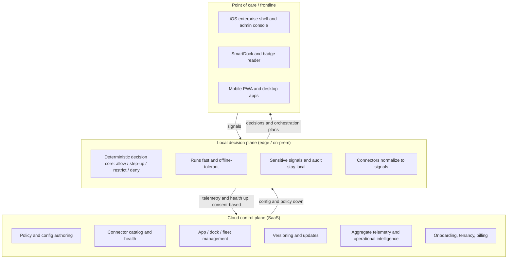

# SignalGrid deployment models

> **Public-safe architecture note.** This describes how SignalGrid is *designed*
> to deploy. It is not a claim of a shipped, certified, or production-hosted
> service. Everything in this repository runs on synthetic, public-safe fixtures
> by default; live vendor calls and any hosted offering are gated and
> configuration-driven.

## TL;DR

SignalGrid is designed as a **split system**: a **cloud control plane** that makes
the ecosystem easy to build and manage, plus a **local decision plane** that keeps
decisions fast, offline-tolerant, and — for regulated environments — resident in
the customer's own environment.

You can run it three ways:

| Model | Control plane | Decision plane | Best for |
|---|---|---|---|
| **Hosted SaaS** | SignalGrid-hosted | SignalGrid-hosted | Fastest start, demos, pilots, low-regulation sites |
| **Self-hosted / on-prem** | Customer-hosted | Customer-hosted | Regulated, data-residency, or air-gapped environments |
| **Hybrid** *(recommended)* | SignalGrid-hosted | Customer-hosted (edge / on-prem) | Central management **and** local, offline-tolerant, resident decisions |

The **hybrid** model is the recommended default because it captures the SaaS
management benefits without giving up the properties that matter most at the
point of care: speed, availability when the network is down, and keeping
sensitive signals local.

## The two planes



### Cloud control plane — why it makes the ecosystem easier to build and manage
- **Ship once.** Update the core, connectors, and policies centrally; every site
  gets the change without a per-site upgrade cycle.
- **Connectors are cheaper.** Build and maintain UEM / NAC / SIEM / EDR / identity
  adapters once, centrally, instead of shipping and configuring them into every
  on-prem install. Webhooks and the MCP endpoint become stable hosted URLs.
- **One pane of glass.** Devices, docks, badge readers, policy versions, and
  connector health across all sites in a single admin console.
- **Fast onboarding.** Design partners and pilots can start in minutes — the demo
  is the top of that funnel.
- **Operational intelligence (roadmap).** Cross-site patterns — friction hotspots,
  posture drift, custody gaps — are hard to produce from isolated boxes; a hosted
  layer (with consent) is what powers Phase 3.

### Local decision plane — why decisions should be able to run locally
- **Speed at the point of care.** A room-entry decision must be fast; a round trip
  to the cloud on every decision is latency you don't want.
- **Availability.** Decisions should still work when the network is down.
- **Data residency.** Regulated / PHI environments often require that sensitive
  signals, decisions, and audit never leave the premises.

## Why the current architecture already supports this

Adding hosted SaaS is **additive, not a rewrite** — the hard part is already built:

- **The decision core is deterministic and self-contained.** It has no ambient
  clock or randomness, no database dependency, and it already runs in a browser —
  so the same core can run at the edge, on-prem, or hosted, unchanged.
- **Tenant is derived from the token.** The `/v1` surface never trusts a
  client-supplied tenant id — the primitive multi-tenancy needs is already in place.
- **Fixture-first, secrets-free by default.** Live integrations are gated behind
  explicit configuration, so a hosted control plane starts from a safe posture.
- **Tiered environments.** `config/tiers/{dev,alpha,beta,prod}.env.example` already
  model promotion; live vendor calls stay off until explicitly enabled.
- **Connectors normalize to one signal shape.** Whether an adapter runs centrally
  or at the edge, it emits the same vendor-neutral signals the core evaluates.

## What lives where (hybrid)

| Concern | Cloud control plane | Local decision plane |
|---|---|---|
| Policy authoring & distribution | ✅ author | ✅ enforce |
| Real-time decisions | — | ✅ |
| Sensitive signals & audit trail | — (aggregate/consented only) | ✅ resident |
| Connector catalog & credentials | ✅ manage | ✅ run (edge) or ✅ run (cloud) |
| App / dock / fleet management | ✅ | — |
| Updates & versioning | ✅ | pulls config |
| Cross-site analytics | ✅ | emits telemetry (consent) |

## Where the planes run — the four hosting tiers

The two planes above say what runs where logically. Physically, each plane
lands in one of the four hosting tiers the data-center industry names, and the
tier decides three things SignalGrid cares about: who holds the signals, how far
a decision travels, and what happens when the link between the planes drops.

| Tier | What it is | Which plane fits | Why it fits | When the link drops |
|---|---|---|---|---|
| **Enterprise / private** | The customer's own data center, operated for one organization | Decision plane; control plane too in the self-hosted model | Control and governance: sensitive signals and the audit trail stay resident, which is the whole reason the decision plane exists | Nothing changes for decisions; policy authoring pauses until the control plane is reachable again |
| **Colocation** | Customer-owned racks inside a third-party facility with dense interconnection | Decision plane for a multi-site customer whose sites already meet there | Interconnection: one decision plane close to several sites and to the identity, network and ITSM systems the connectors read | Same as private; the facility's cross-connects are what keep the connectors reachable |
| **Hyperscale / cloud region** | A cloud provider's region | Control plane (the hosted and hybrid models); decision plane only in the hosted model | Scale and repeatability: policy distribution, fleet management, cross-site analytics and the MCP endpoint want stable hosted URLs and elastic capacity | Decisions at edge or private sites continue on the policy they last pulled; hosted-model sites lose decisions with the link, which is why hosted is for low-regulation pilots |
| **Edge** | Compute inside or beside the building, near doors, devices and docks | Decision plane in the hybrid model | Proximity: a decision that gates a door or a device should not cross a WAN to be made | Decisions continue locally; a signal that cannot be refreshed reads as unknown, and unknown raises assurance (golden rule 2) rather than loosening the answer |

Two things follow. First, the decision core is the same code in every tier.
Policy evaluation is a pure function of a policy version and the evidence it is
handed (`evaluatePolicy` in `lib/signalgrid-core/src/policy.ts`), and the
decision path around it is deterministic (`review-invariants` pins every clock
read in `lib/`), so nothing about the verdict is tier-specific; what differs is
the transport around it, and the transport is where the latency lives (see the
in-process versus over-HTTP table in [`RELIABILITY_SLO.md`](./RELIABILITY_SLO.md)).
Second, the "when the link drops" column rests on proven semantics and one
unproven mechanism, and the line between them matters. Proven: a decision made
without the control plane can never relax what a connected decision would have
said, and past a bound the offline decision is raised to a floor
(`lib/signalgrid-core/src/continuity.ts`, held by `proof:decision-continuity`);
a local authority's weight decays as the disconnected interval grows
(`lib/integrations/src/integrations/local-authority/evaluate.ts`, held by
`proof:local-authority`); and the control plane serves the policy bundle an edge
node runs (`GET /cp/v1/policy-bundle`). Not proven: **no test in this repository
partitions the link between a running control plane and a running decision
plane, and no edge appliance has been built.** Those two are design targets until
a proof runs them.

## Sizing by site — what scales and what does not

Size is not a tier. A single clinic and a hospital campus can both sit in the
edge tier; what changes between them is demand, and demand is what to size for.

**Demand model.** Decisions per second at a site is the sum over its signal
sources of events that reach the gate:

```
decisions/sec ≈ Σ over source types ( events per source per hour × count of sources of that type ) / 3600
```

where a source is a door, a shared device, a dock, an app step-up prompt or a
scheduled posture poll. Count sources from the site's own inventory; do not
estimate them. A worked example, with every number an ASSUMPTION for the arithmetic
and not a measurement: a 40-door, 200-shared-device building where each door
sees 30 badge events an hour and each device 6 session events an hour produces
(40 × 30 + 200 × 6) / 3600 ≈ 0.67 decisions/sec on average. Peaks at shift change
are the number that matters; plan for ten times the average unless the site's
own badge logs say otherwise.

**Supply, in the order that binds.** One shipped constant and two
measurements, the measurements taken on one four-core machine and recorded with
their date in [`RELIABILITY_SLO.md`](./RELIABILITY_SLO.md), which is the
authority for these numbers; this section restates them and each carries its
date so a re-measurement there is visibly a drift here.

1. **The shipped rate limit binds first.** 240 requests per minute per key
   (the default in `rateLimit.ts`, re-confirmed live 2026-08-24), four
   decisions a second, is what a tenant gets unless `SIGNALGRID_V1_RATE_LIMIT`
   is raised deliberately. Against the worked example's ten-times peak
   (6.7/sec) the default limiter is the constraint, not the engine.
2. **The HTTP path binds second.** 585 requests per second through `/v1` at
   concurrency 32 (measured 2026-08-24), transport and middleware included;
   the worked example's peak uses about one percent of it.
3. **The core binds last.** 1,529 decisions per second on one core in process
   and 5,370 across four workers at 88 percent of linear (measured 2026-08-24),
   identical verdicts on every worker. Sizing never reaches this number before
   it reaches the other two.

**What scales horizontally today.** Policy evaluation is pure, and the
throughput bench shows independent cores multiplying capacity — each bench
worker runs its own seeded core and store, so what it measures is N independent
decision planes, not one plane spread across N workers. Connectors are read
paths (every family is gated, proven and action-free under
`check-connector-discipline`).

**What does not scale by adding nodes yet, stated so nobody sizes around a
property that is not there:** every decision appends to its tenant's audit
chain by reading the chain head and writing the next digest
(`lib/signalgrid-core/src/audit.ts`), a per-tenant serialization point; the
durable ledger is one chain per tenant in one Postgres; the rate limiter is per
key and per process; no per-site sharding of connectors exists; and no
multi-node decision-plane deployment has been run, measured or proven. A
multi-site customer today is several independent decision planes reporting to
one control plane, not one plane spanning sites.

## Honest boundaries

- The hosted **SaaS offering is a design direction**, not a live, certified
  service today. This repo is a public-safe prototype.
- The **hardware layer** (SmartDock, badge/RFID reader case) is an optional,
  pre-production design concept — SignalGrid runs fully on software-only signals.
- SignalGrid is a **planner**: it never actuates a real device, and it does not
  replace IAM / UEM / SIEM / ITSM / NAC systems — it decides and orchestrates on
  top of the signals they (and the hardware) produce.

See also: [`SIGNALGRID_SMARTDOCK.md`](./SIGNALGRID_SMARTDOCK.md) (hardware layer),
[`RUN_ON_MAC.md`](./RUN_ON_MAC.md) (run it locally), and the
[`/v1` OpenAPI spec](../lib/api-spec/v1-openapi.yaml).
