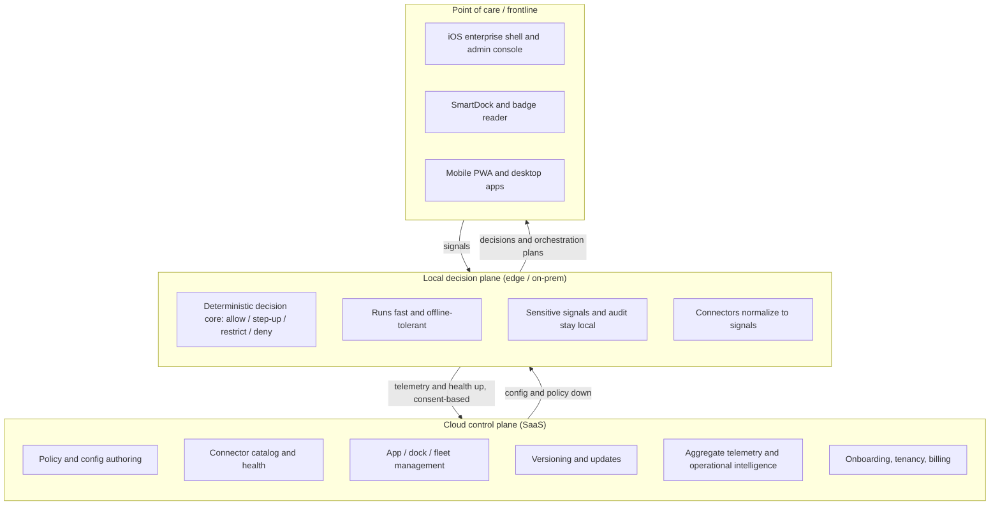

# SignalGrid deployment models

> **Public-safe architecture note.** This describes how SignalGrid is *designed*
> to deploy. It is not a claim of a shipped, certified, or production-hosted
> service. Everything in this repository runs on synthetic, public-safe fixtures
> by default; live vendor calls and any hosted offering are gated and
> configuration-driven.

## TL;DR

SignalGrid is designed as a **split system**: a **cloud control plane** that makes
the ecosystem easy to build and manage, plus a **local decision plane** that keeps
decisions fast, offline-tolerant, and — for regulated environments — resident in
the customer's own environment.

You can run it three ways:

| Model | Control plane | Decision plane | Best for |
|---|---|---|---|
| **Hosted SaaS** | SignalGrid-hosted | SignalGrid-hosted | Fastest start, demos, pilots, low-regulation sites |
| **Self-hosted / on-prem** | Customer-hosted | Customer-hosted | Regulated, data-residency, or air-gapped environments |
| **Hybrid** *(recommended)* | SignalGrid-hosted | Customer-hosted (edge / on-prem) | Central management **and** local, offline-tolerant, resident decisions |

The **hybrid** model is the recommended default because it captures the SaaS
management benefits without giving up the properties that matter most at the
point of care: speed, availability when the network is down, and keeping
sensitive signals local.

## The two planes

### Cloud control plane — why it makes the ecosystem easier to build and manage
- **Ship once.** Update the core, connectors, and policies centrally; every site
  gets the change without a per-site upgrade cycle.
- **Connectors are cheaper.** Build and maintain UEM / NAC / SIEM / EDR / identity
  adapters once, centrally, instead of shipping and configuring them into every
  on-prem install. Webhooks and the MCP endpoint become stable hosted URLs.
- **One pane of glass.** Devices, docks, badge readers, policy versions, and
  connector health across all sites in a single admin console.
- **Fast onboarding.** Design partners and pilots can start in minutes — the demo
  is the top of that funnel.
- **Operational intelligence (roadmap).** Cross-site patterns — friction hotspots,
  posture drift, custody gaps — are hard to produce from isolated boxes; a hosted
  layer (with consent) is what powers Phase 3.

### Local decision plane — why decisions should be able to run locally
- **Speed at the point of care.** A room-entry decision must be fast; a round trip
  to the cloud on every decision is latency you don't want.
- **Availability.** Decisions should still work when the network is down.
- **Data residency.** Regulated / PHI environments often require that sensitive
  signals, decisions, and audit never leave the premises.

## Why the current architecture already supports this

Adding hosted SaaS is **additive, not a rewrite** — the hard part is already built:

- **The decision core is deterministic and self-contained.** It has no ambient
  clock or randomness, no database dependency, and it already runs in a browser —
  so the same core can run at the edge, on-prem, or hosted, unchanged.
- **Tenant is derived from the token.** The `/v1` surface never trusts a
  client-supplied tenant id — the primitive multi-tenancy needs is already in place.
- **Fixture-first, secrets-free by default.** Live integrations are gated behind
  explicit configuration, so a hosted control plane starts from a safe posture.
- **Tiered environments.** `config/tiers/{dev,alpha,beta,prod}.env.example` already
  model promotion; live vendor calls stay off until explicitly enabled.
- **Connectors normalize to one signal shape.** Whether an adapter runs centrally
  or at the edge, it emits the same vendor-neutral signals the core evaluates.

## What lives where (hybrid)

| Concern | Cloud control plane | Local decision plane |
|---|---|---|
| Policy authoring & distribution | ✅ author | ✅ enforce |
| Real-time decisions | — | ✅ |
| Sensitive signals & audit trail | — (aggregate/consented only) | ✅ resident |
| Connector catalog & credentials | ✅ manage | ✅ run (edge) or ✅ run (cloud) |
| App / dock / fleet management | ✅ | — |
| Updates & versioning | ✅ | pulls config |
| Cross-site analytics | ✅ | emits telemetry (consent) |

## Honest boundaries

- The hosted **SaaS offering is a design direction**, not a live, certified
  service today. This repo is a public-safe prototype.
- The **hardware layer** (SmartDock, badge/RFID reader case) is an optional,
  pre-production design concept — SignalGrid runs fully on software-only signals.
- SignalGrid is a **planner**: it never actuates a real device, and it does not
  replace IAM / UEM / SIEM / ITSM / NAC systems — it decides and orchestrates on
  top of the signals they (and the hardware) produce.

See also: [`SIGNALGRID_SMARTDOCK.md`](./SIGNALGRID_SMARTDOCK.md) (hardware layer),
[`RUN_ON_MAC.md`](./RUN_ON_MAC.md) (run it locally), and the
[`/v1` OpenAPI spec](../lib/api-spec/v1-openapi.yaml).
