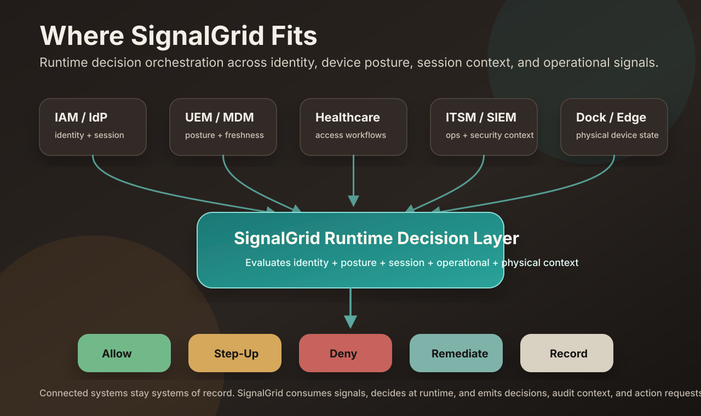

# Ecosystem Positioning

> **`docs/POSITIONING.md` is canonical for how SignalGrid is described.** This
> page is the ECOSYSTEM map — how the product relates to neighbouring system
> categories — and it does not get to define the product. Where the two
> disagree, POSITIONING.md wins and this page gets fixed to it. Corrected
> 2026-08-23: this document opened with two unratified product labels and named
> the Microsoft wedge that DR-012 reversed. Corrected again 2026-09-02: the
> opening sentence still carried DR-011's category label, which DR-019 superseded
> on 2026-08-26 and DR-020 reinforced. It survived because the retired-label scan
> read the marketing surface and not this page.

SignalGrid is an **access-decision service** for shared-device and mobile frontline environments — the descriptor `docs/POSITIONING.md` keeps for a cold reader, and a description rather than a category claim. **There is no ratified category label** (DR-019 ratified none, deferring the question to customer discovery), and `docs/PURPOSE.md` §2 owns the product sentence, which this page does not restate. It is not another IAM, UEM/MDM, ITSM, SIEM/SOAR, NAC, healthcare access-management, or hardware platform. Those systems remain the systems of record for their own domains.

SignalGrid consumes signals from those systems, evaluates runtime context, determines an access outcome, and emits decision evidence or action requests back to connected workflows.

## Main takeaway

- **IAM authenticates identity.**
- **UEM/MDM proves device posture.**
- **ITSM/SIEM record and investigate.**
- **DEX, endpoint, and observability tools expose operational health.**
- **RTLS/DockBridge proves physical and workflow context.**
- **SignalGrid evaluates runtime trust and routes the outcome.**

SignalGrid fits in the decision gap between systems that authenticate users, manage devices, measure endpoint/user experience, monitor APIs and services, record operations, investigate security events, and observe shared-device movement. It evaluates identity, device posture, session context, physical/device context, workflow context, and operational signals before the workflow breaks.

## Operated as code: the GitOps control plane

SignalGrid's operating model is Infrastructure-as-Code / GitOps (see
[`IAC_GITOPS.md`](IAC_GITOPS.md)). Endpoint configuration, compliance policy,
software packages, and the decision rules that gate them are declared in
version-controlled files and rolled out through review and approval, not clicked
into a console. This does not make SignalGrid an MDM. **Fleet, Microsoft Intune,
and Jamf remain the declarative backends** that actuate a profile on a device;
SignalGrid holds the desired state, plans the diff, gates the rollout on a live
`allow` decision plus a recorded human approval (a rollout can never apply
itself), and drift-checks the result — feeding any divergence back as a trust
signal. It complements a Fleet GitOps repo or a Terraform+Intune module; it is
not a competing MDM or IaC tool, and does not replace one.

## Architectural analogy: the trust control plane

Enterprise networking learned this pattern long ago. A hub-and-spoke topology (AWS
Transit Gateway, Azure Virtual WAN, Google Cloud Network Connectivity Center)
centralizes routing, inspection, and shared services in a dedicated hub so the
spokes stay simple and isolated; the hard-won lesson is that *a hub without
centralized inspection is just an expensive peering mesh*, and that the hub is not
a network component so much as an **enterprise control plane** worth treating as a
product.

SignalGrid is the same pattern applied to a different plane. It does not route
packets and it never touches a route table — the network hub remains the system of
record for connectivity. SignalGrid is the **centralized inspection point for
runtime trust**: instead of every workload deciding on its own whether a person,
device, and moment are trustworthy, that decision is centralized, evaluated against
fused signals, and routed to whoever resolves it. The spokes — the host apps a
worker actually uses — stay simple and focused on the work.

The lessons transfer almost verbatim:

- *Routing is a security policy; route-table changes deserve IAM-grade governance.*
  In SignalGrid, a policy or a self-healing fix is a governed, human-approved change
  — a proposal can never activate itself (`docs/ADAPTIVE_PROPOSALS.md`,
  `docs/SELF_AUDIT.md`).
- *Spoke-to-spoke should be the exception, not the default.* Trust is
  re-established per device from that device's own signals; a carried work context
  is descriptive, never a grant that flows sideways (`docs/PORTABLE_WORK_CONTEXT.md`).
- *Shared services belong in the platform, not duplicated per workload.* Domain
  safety stays in the host apps; the decision, the audit trail, and the signal
  fusion live once, in the fabric.

The point of both hubs is the same: not better plumbing, but a platform that is
easier to secure, operate, and scale — with less downtime — and every workload
connected to it benefits. SignalGrid is complementary to the network hub, not a
competitor to it: the two inspect different planes and neither replaces the other.

## The operating-stack framing

SignalGrid turns the IT operating stack into a decision fabric: digital
workplace, network, cloud, ITSM, integration, governance, and physical-world
signals become one explainable allow / step-up / restrict / deny decision with
routed ownership and audit evidence. The layer-by-layer map of every existing
surface — and the seventh, physical/operational layer the standard six-layer
stack taxonomy has no slot for — lives in
[OPERATING_STACK_LAYER_MAP.md](OPERATING_STACK_LAYER_MAP.md).

## Ecosystem positioning matrix

| Category                          | Examples                                                                                                                                                                                                                                                                | What the category owns                                                                                                                                     | What SignalGrid consumes                                                                                                                                                                                                                                                           | What SignalGrid emits                                                                                                                                                                                                                     | Replacement boundary                                                                                                                                                                                    |
| --------------------------------- | ----------------------------------------------------------------------------------------------------------------------------------------------------------------------------------------------------------------------------------------------------------------------- | ---------------------------------------------------------------------------------------------------------------------------------------------------------- | ---------------------------------------------------------------------------------------------------------------------------------------------------------------------------------------------------------------------------------------------------------------------------------- | ----------------------------------------------------------------------------------------------------------------------------------------------------------------------------------------------------------------------------------------- | ------------------------------------------------------------------------------------------------------------------------------------------------------------------------------------------------------- |
| IAM / IdP                         | Entra ID, Okta, Ping, Duo, Auth0, Keycloak, Azure AD B2C / External ID                                                                                                                                                                                                  | User authentication, identity directory, SSO, MFA, identity claims, Conditional Access or identity/session policy.                                         | User identity, group/role context, MFA status, Conditional Access result, session state, risk/context signals, guest/external identity type where available.                                                                                                                       | Runtime trust decision, audit context, review request, step-up/restrict/deny recommendation where supported.                                                                                                                              | SignalGrid does not replace the IdP, directory, SSO, MFA, Conditional Access, or identity lifecycle system.                                                                                             |
| IGA                               | SailPoint / IGA, Saviynt                                                                                                                                                                                                                                                | Access governance, identity lifecycle governance, access certifications, entitlement review, privileged identity governance, separation-of-duty processes. | Privileged identity state, access review/certification state, governance status, entitlement context, lifecycle/risk signals where available.                                                                                                                                      | Decision evidence, access-review context, remediation, restriction, or recertification request.                                                                                                                                           | SignalGrid does not replace IGA governance, certification, lifecycle, or entitlement-management programs.                                                                                               |
| UEM / MDM                         | Intune, Jamf, Workspace ONE, Fleet                                                                                                                                                                                                                                      | Device enrollment, compliance policy, configuration profiles, software inventory, device actions, managed-device lifecycle.                                | Device ID, ownership, compliance, posture, OS/version, encryption, jailbreak/root, check-in freshness, profile state.                                                                                                                                                              | Normalized posture decision, audit record, remediation request, operator/admin review recommendation.                                                                                                                                     | SignalGrid does not replace UEM/MDM enrollment, profile deployment, compliance policy, or device-management actions.                                                                                    |
| Healthcare access management      | Imprivata                                                                                                                                                                                                                                                               | Clinical access workflows, strong authentication, badge and shared-workstation context, mobile/medical-device access workflows where validated.            | Future candidate workflow, identity/session, badge, clinical context, and shared-device signals if an approved integration exists.                                                                                                                                                 | Future candidate decision evidence, escalation, review, or workflow request.                                                                                                                                                              | SignalGrid does not claim a current Imprivata partnership, certification, validated integration, or replacement relationship.                                                                           |
| ITSM                              | ServiceNow, Jira Service Management                                                                                                                                                                                                                                     | Incidents, requests, changes, approvals, assignments, service workflows, work records.                                                                     | Ticket status, change windows, approval state, incident context, assignment/ownership context.                                                                                                                                                                                     | Ticket creation/update request, remediation task, review request, evidence packet, audit note.                                                                                                                                            | SignalGrid does not replace ITSM workflows, ticket lifecycle, approvals, or service operations.                                                                                                         |
| SIEM / SOAR                       | Microsoft Sentinel, Splunk                                                                                                                                                                                                                                              | Security analytics, detection engineering, event correlation, investigation, response playbooks, retention.                                                | Security alerts, correlated risk, incident context, investigation state, severity, enrichment.                                                                                                                                                                                     | Enriched decision event, audit trail, security event, SOAR handoff or response request.                                                                                                                                                   | SignalGrid does not replace detection, investigation, SOAR automation, retention, or security analytics platforms.                                                                                      |
| NAC / Network                     | Cisco ISE, Aruba/ClearPass                                                                                                                                                                                                                                              | Network admission, segmentation, VLAN/session enforcement, network posture, network access policy.                                                         | Network session, device network posture, location hints, admission state, segmentation context.                                                                                                                                                                                    | Restrict/quarantine/review recommendation, decision evidence, audit event, policy context.                                                                                                                                                | SignalGrid does not replace NAC enforcement, switching/wireless control, segmentation, or network policy systems.                                                                                       |
| Operational Health / DEX          | ControlUp, Nexthink, Riverbed Aternity, Lakeside SysTrack, TeamViewer DEX, Tanium, Ivanti Neurons, Intune Endpoint Analytics, Defender for Endpoint, CrowdStrike, SentinelOne, Datadog, Splunk, Azure Monitor, ServiceNow, Jira Service Management, PagerDuty, Opsgenie | Endpoint performance, DEX, monitoring, alerting, API/service health, ITSM ownership, incident severity, escalation, and routed-remediation workflows.      | Device online/offline state, last check-in age, CPU/memory/disk pressure, app/service crash rate, network/VPN/Wi-Fi/DNS health, EDR/AV state, patch posture, Teams/VDI quality, API latency/error/webhook/stale-sync signals, ticket state, owner, severity, and impacted service. | Runtime trust decision, operator alert, ITSM ticket request/update, email/mobile/Slack/Teams/PagerDuty/Opsgenie notification, posture refresh or MDM sync request, EDR investigation/isolation request, team routing, and audit evidence. | SignalGrid does not replace DEX, RMM, EDR, SIEM, monitoring, observability, ITSM, UEM/MDM, or endpoint platforms; existing tools remain systems of record and high-risk actions require approval gates. |
| Endpoint telemetry                | Defender, CrowdStrike, FleetDM                                                                                                                                                                                                                                          | Endpoint detection, sensor telemetry, host risk, vulnerability/exposure data, fleet inventory, endpoint response.                                          | Endpoint risk, alert state, sensor health, vulnerability/exposure, host posture, fleet freshness signals.                                                                                                                                                                          | Decision/audit event, review request, remediation recommendation, enrichment for investigation.                                                                                                                                           | SignalGrid does not replace EDR, endpoint telemetry collection, response tooling, or fleet inventory systems.                                                                                           |
| CSPM / CNAPP                      | Defender for Cloud, Wiz, Prisma Cloud                                                                                                                                                                                                                                   | Cloud-estate posture: misconfiguration detection (a service intended private still reachable or resolving publicly, missing private-DNS zone links), cloud-resource compliance, attack-path analysis, and remediation of the operator's own cloud infrastructure.        | Nothing today, deliberately. The fabric grades devices, identities, and sessions — never the operator's cloud estate — and it never probes cloud infrastructure itself. A future bridge could supply the platform's already-evaluated estate posture as caller-supplied context for a deployment that gates on its own control-plane health.                        | Candidate: decision evidence and audit context, if an operator chooses to pose estate health as policy.                                                                                                                                    | SignalGrid does not replace CSPM/CNAPP scanning, cloud compliance, or cloud-resource remediation; the cloud platform and its posture tools remain the systems of record for the estate.               |
| Dock / Edge shared-device systems | Docks, smart cabinets, return stations                                                                                                                                                                                                                                  | Physical device state, slot occupancy, charging state, device return/release events, local hardware behavior.                                              | Dock/undock events, wrong-slot return, missing device, charging fault, dock online/offline, device/location identifiers.                                                                                                                                                           | Runtime decision event, operator/admin alert, ticket/audit event, remediation or review request.                                                                                                                                          | SignalGrid does not replace dock hardware, accessory certification, firmware, local safety controls, or hardware systems of record.                                                                     |
| Agentic control surfaces          | Cisco Cloud Control, MCP-style platforms                                                                                                                                                                                                                                | Unified operations workspaces, governed agent workflows, normalized APIs/tool surfaces, marketplace or studio extensions, source-platform policy controls. | Future connector or orchestration context such as read-only signals, scoped tool/action requests, simulation results, approval state, and action metadata where approved integrations exist.                                                                                       | Decision evidence, policy evaluation, signed action request, approval requirement, simulation result, audit record.                                                                                                                       | SignalGrid does not compete with broad infrastructure control planes or claim current Cisco, MCP, marketplace, or agentic-platform integration.                                                         |
| Operational data platform / ontology | Palantir Foundry (Ontology, OSDK, AIP), Databricks, Snowflake | Enterprise data integration, semantic/ontology modelling, operational forecasting and recommendation, command-centre dashboards, and writeback to modelled objects. | Nothing today, deliberately. An operator could publish caller-supplied policy — shift windows, service criticality, resolution targets — which this fabric compares against rather than infers. | Candidate: decision evidence, device custody state, and session state expressed as ontology objects. These are facts an operations command centre does not otherwise hold, because it models patients, beds and staff rather than the device in a worker's hand. | SignalGrid does not claim a Palantir partnership, certification, marketplace listing, or validated integration, and does not replace a data platform, ontology, or command centre. The reverse boundary is not symmetric marketing: per Palantir's own OSDK documentation an OSDK client is constructed from a Foundry stack URL plus OAuth2 credentials, so it cannot answer while the platform is unreachable. |
| SignalGrid                        | Runtime decision orchestration                                                                                                                                                                                                                                          | Runtime access decision orchestration across identity, posture, session, workflow, operational, and physical/shared-device signals.                        | Identity context, device posture, session context, workflow context, operational context, security context, dock/edge events.                                                                                                                                                      | Allow, step-up, deny, restrict, remediate, record, review request, audit evidence, action request.                                                                                                                                        | SignalGrid preserves connected systems as systems of record and does not position itself as their replacement.                                                                                          |

## Objection handling

### “Why not just extend our existing IAM/UEM/ITSM stack?”

Use those systems. SignalGrid is not trying to replace them.

Those systems authenticate users, manage devices, record work, investigate events, or enforce policy. SignalGrid sits in the decision gap between them. It evaluates identity, device posture, session context, physical/device context, and operational signals at runtime, then determines the correct access outcome before the workflow breaks.

In practical terms, SignalGrid can consume identity/session context from IAM, posture and freshness from UEM/MDM, governance context from IGA, operational state from ITSM, endpoint/user-experience health from DEX and endpoint platforms, API/service health from monitoring and observability tools, security context from SIEM/SOAR and endpoint telemetry, network context from NAC, and physical/workflow shared-device state from RTLS, DockBridge, and dock/edge systems. It can then emit decisions, audit context, and action requests back to the connected systems that already own execution and records.

### "Our vendors already integrate with each other — why do we need a layer above that?"

Use those integrations too. They are real, they work, and SignalGrid does not replace them.

The reference case is an EDR isolating a host while the UEM still reports that device healthy and
compliant: the worker loses access, the help desk sees no explanation, and Security and IT hold
different versions of reality. Vendor-to-vendor workflows close exactly that pair — a detection
triggers a management action and a user notification, and the reverse workflow is designed in
advance. That is the right way to solve a two-system problem.

What a point-to-point workflow cannot do is answer a question whose inputs come from more than its
own pair. The EDR says contained; the UEM says compliant; the asset register names a different
custodian; the identity plane says the account is privileged; the badge plane puts the worker in a
restricted zone; the host app has a critical action half-finished; the ITSM says an approved change
window is open. Each integration in that list knows two of those facts.

**SignalGrid does not reconcile an EDR with a UEM. It consumes whatever each of them concluded,
keeps both on the record ranked, and lets the stronger concern decide — so a disagreement between
two vendors can only ever raise assurance, never grant it.**

Two consequences are worth stating precisely, because they are the difference between this and an
arbiter. First, the fabric never adjudicates: `composeDeviceRisk` retains every input signal in
`drivers`, ranked, rather than discarding the calmer one, and strongest-concern-wins is
unconditional — so there is no code path in which one vendor's verdict overrides another's into a
grant. Second, coexistence is not contradiction. "The EDR contained this host" and "the UEM says
this device passes its compliance policy" are two different predicates — runtime behaviour versus
configuration conformance — and both are routinely true at the same moment. This fabric models
contradiction only where one predicate has two answers (a tunnel claimed but not observed, an
identity that does not match itself, a badge crossing that the space graph refuses). Treating two
true statements about different things as a conflict would manufacture an alarm out of a normal
state, so it deliberately does not.

### "Why isn't this just an app on our data platform's ontology?"

Because a fail-closed gate at the device is not a data-modelling problem.

Palantir's own Ontology SDK documentation describes an OSDK client as constructed from a Foundry
stack URL plus OAuth2 client credentials, scoped by a token to the ontological entities the
application declared. That is a sound security model and the right shape for an analytics or
workflow application. It also means the client cannot return an answer while the platform is
unreachable, and that every answer costs a network round trip.

A worker tapping a badge on a shared cart needs a verdict inside the fabric's 50 ms latency
objective, on a device that may have lost its uplink, and the verdict must be wrong in the safe
direction whenever a signal is missing. This decision core reads no clock, performs no I/O in the
decision path, and is replayable — the same recorded inputs always produce the same verdict. Those
are not properties that can be added to a platform client afterwards; they are what the core is.

The two compose rather than compete. A command centre models patients, beds and staff. It does not
model whether the cart in bay three is checked out to a badge that is still valid, nor whether that
device's posture still supports the app the worker is about to open. Those are facts this fabric
produces, and publishing them into an ontology is a candidate integration — not a current one.

## Where SignalGrid sits when the caller is an agent

Take any "agent as a service" reference architecture — the loop (think, act, observe,
repeat), the runtime blocks (context, RAG, harness, memory, loop, operations,
evaluation), the build path (LangChain, LangGraph, CrewAI, n8n), and a row across the
bottom labelled **Tools & Integrations — what the agent can act on**.

SignalGrid is not the agent in that picture. It is one of the tools in that row.

This is worth stating because it is the opposite of how the fabric is usually
introduced, and because it settles two questions at once:

- **What SignalGrid is not.** It is not an agent framework, not a model gateway, and
  not an LLMOps observability product. Context engineering, retrieval, memory,
  prompt management, token cost, latency traces, plan quality and regression scoring
  are how you build and operate an agent. They are outside the boundary, and being
  outside it is what keeps the decision core small enough to be deterministic.
- **What SignalGrid is.** The runtime that answers allow / step_up / restrict / deny
  when that agent — or the human it is working for — tries to do something on a
  frontline device. The governance column those posters draw (authorization, tool
  permissions, audit logs, rate limits, policy enforcement, human-in-the-loop) is not
  a feature list here; it is a set of GATES with named reason codes. An agent acting
  unrecorded is `AGENT_UNRECORDED` → restrict. An approval that lapsed while access
  persisted is `APPROVAL_EXPIRED` → escalate, ranked above one that never existed. A
  rate no person could produce is `SUPERHUMAN_CADENCE`. A policy that is bound but
  running in report-only mode is governed on paper and gated by nothing.

### The discipline the tool role demands

Being a tool inside somebody else's loop changes who the caller is, and that changes
what silence means. A human operator omits a field because they judged it irrelevant.
**An agent omits a field because it does not know the answer** — it cannot know an
RTLS source's health or which map a fix was taken against, so omission is the normal
case rather than the exceptional one.

The rule that follows is short: **when the caller is an agent, every optional input is
a claim, and omitting it is a non-claim rather than a pass.** Hand the caller's value
through and let the normalizer decide what silence means.

## Where SignalGrid sits when enforcement moves off the endpoint

Hardware-enforced edge microsegmentation puts a first-hop device in front of an asset
and enforces layer 2-4 policy OUTSIDE the host OS. For assets that cannot defend
themselves — unpatchable controllers, legacy equipment, medical devices, kiosks,
contractor endpoints — it is a genuinely strong control, and it is not a competitor to
anything SignalGrid does. **SignalGrid is not the packet-enforcement appliance and
should not become one.**

The reason it matters here is a second-order effect that the prevention story hides:

> *The telemetry did not disappear. It moved.*

Successful prevention complicates reconstruction. Traffic becomes an encrypted tunnel;
source context shifts to the overlay; passive sensors and discovery paths that used to
answer questions stop being asked. The evidence still exists — it is just generated
somewhere else, by something else, in a different shape. **And trust moves with it:**
the edge firmware, its policy service, the overlay credentials and the management plane
all join the trusted computing and recovery path. Whoever can change fleet-wide policy
can reroute traffic, isolate systems, or break the recovery channel.

### The failure mode is substitution, not absence

The fabric already handles evidence going *absent*. `proof:absent-collection` pins
NOTHING OBSERVED IS NOT THE SAME AS NOTHING WRONG at every site that grades a
collection, and an unreachable source raises assurance rather than passing.

Relocation is a different shape, and it is the harder one. The source does not go
silent — it is **replaced by a different source answering a different predicate that
sounds affirmative.** A passive sensor answers *"what did I observe on the wire?"* An
enforcement appliance answers *"I enforced policy and allowed the flow."* Those are not
the same claim: the first is an observation, the second attests the enforcer's own
output. Substituting one for the other is the watermelon distinction
(`response-accountability`) crossed with a dominance failure — a weaker affirmative
standing in where a stronger one has quietly stopped answering.

Nothing in the fabric detects that today, because a healthy affirmative arriving looks
exactly like a healthy affirmative arriving. Naming it is the point: **a deployment can
improve its prevention posture and degrade its explainability in the same change, and
neither number moves in a way anyone is watching.**

### So the position is narrow and it holds

SignalGrid correlates identity, asset, endpoint, edge-policy, network, workflow and
management-plane evidence, and answers one question per action: *should this verified
person, on this asset, through this enforcement policy, in this workflow and operational
context, be permitted to do this now?* The hardware blocks the packet. The fabric keeps
the decision explainable afterwards — who changed the policy, why the flow was blocked,
which asset and worker were involved, what the evidence says now and where it lives.

**The entry requirement, if such a source is ever consumed, is a visibility contract.**
Not a feature list — a statement, per connector, of what remains locally visible, what
becomes encrypted, where flow records are generated, how original source context is
preserved, how policy changes are attributed, how fail-open and fail-closed are
reported, how human bypass is detected, how evidence is exported when the management
plane is unavailable, and which system owns the authoritative record. A connector that
cannot say where the evidence now lives cannot be graded — only believed, which is the
one thing this fabric never does with a vendor's own affirmative.

## Where SignalGrid sits when the buyer builds an AI platform team

The tool role above answers *what calls SignalGrid*. The next question is *who owns the
thing that calls it*, and the enterprise-AI operating-model literature has converged on
an answer: a dedicated **AI Platform Engineering** organization, running AI the way
DevOps taught the industry to run cloud — ModelOps, PromptOps, KnowledgeOps, AgentOps,
GovernanceOps, and a shared platform beneath them all.

Three of those domains are outside SignalGrid **by construction, not by omission**, and
the distinction is worth stating precisely because "we don't do that" and "we cannot do
that and that is the point" are different claims. SignalGrid runs no model, holds no
prompt in any decision path, and owns no knowledge base. Golden rule 2 forbids a clock or
a random source in a decision path, and `@workspace/signalgrid-core` declares zero
dependencies. ModelOps, PromptOps and KnowledgeOps have nothing to attach to here — and
that emptiness is what keeps the core small enough to be replayed, digested and proven.

Where SignalGrid *does* sit is in that team's service catalogue, next to shared identity
and shared observability: **the shared policy-enforcement and governance service.** The
charter such a team is given — "identity integration, platform governance, security
controls, platform reliability" — names the seam directly. And the framing that
governance is *an operational capability rather than an annual audit* is not an
aspiration to adopt here; it is the fabric's premise, already load-bearing: every
decision is per-action at runtime, carrying its policy version and a digest-sealed
evidence snapshot into a chained ledger.

### One metric in that operating model points the wrong way

The literature proposes replacing benchmark scores with business metrics, and the list is
mostly right: hours saved, incident-resolution speed, workflows completed autonomously,
recommendations accepted, operational risk reduced. One entry on it is different:
**"how often did humans intervene."**

SignalGrid produces that number — a `step_up` *is* a human intervention, and
`MetricsSummary.byOutcome` counts them. Read as an efficiency metric it has an obvious
direction: drive it down. And the cheapest way to drive it down is to stop asking.

That is the unearned affirmative arriving as a KPI rather than as a code defect, which
makes it harder to see than any of the versions this repo has already fixed in source. A
dropped `?? "healthy"` is a diff someone can review. A quarterly target that rewards
fewer step-ups is a goal nobody reviews as a change to the decision path at all, and it
applies pressure to every future policy edit at once.

So the position is: **the step-up rate is a health signal, not a cost.** It says the
fabric is finding the cases it should find. A falling step-up rate with unchanged device,
identity and workflow posture is a regression to investigate, not an improvement to
report — and the pairing that makes it legible is the one the fabric already emits
alongside it: `restrictDenyRate` and `decisionsWithEvidence`. Intervention counts mean
nothing without the posture they were measured against.

This is not theoretical. Three defects of exactly that shape were found and fixed on
SignalGrid's own MCP surface in a single session:

1. `source_health ?? "healthy"` — an assistant that asserted nothing and one that
   asserted everything received byte-identical `SUFFICIENT_CERTAINTY / none / known`.
2. `additionalProperties: false` advertised and never enforced — a caller who
   correctly posed a freshness bound, spelled in the other of the two naming
   conventions the same tool uses, had it silently dropped; a 6.5-year-stale location
   fix then graded as sufficient certainty.
3. A connector config schema where a misspelled `enabled` key re-enabled a connector
   an operator had switched off.

All three are the same failure with different clothes, and all three are now pinned by
`proof:mcp-answer-discipline`, which drives the real server over its real stdio wire
and asks not whether it answers but whether the answer is **earned**. That proof is
the concrete form of this positioning: if SignalGrid is going to sit in the tools row
of an agent architecture, the thing it owes that architecture is an answer that never
claims more than the caller gave it.

## Where SignalGrid sits when the network is private 5G

Intake ledger row 55. The owner's framing is the right one and worth keeping verbatim:
**5G connects the devices; SignalGrid decides what the connected situation means.**
Private wireless, network slicing and MEC give the grid more real-world signals; none
of them decide anything about a workflow, and SignalGrid does not run a network.

The expansion story is genuinely large — manufacturing, warehouse, logistics,
healthcare, smart city, energy, fleet, remote operations — and it is explicitly **not
the launch wedge**. Per DR-012 the wedge is Fleet-first: the source-agnostic
device-management evidence contract, proven LIVE against Fleet (TLS with a real
osqueryd agent) — the management plane lean IT teams actually run — → one
shared-device workflow → one live decision loop. Microsoft Entra/Intune stays
implemented and wire-hardened as the enterprise connector, awaiting a real
tenant, which arrives when a prospect brings one. This section is the expansion map,
recorded so the sequencing is a decision rather than a drift.

**What already exists.** The connectivity plane is not a gap; it is four deliberately
non-overlapping dimensions, each of which stops where the next begins:

| Question | Dimension | Where it stops |
| --- | --- | --- |
| Was the device admitted to the network? | `network-nac` | The point of connection — 802.1X, segment, quarantine, and the switch port as coarse location. |
| Is the link it landed on actually carrying traffic? | `link-usability` | Association, auth, DHCP and DNS as separate rungs, because "associated" is a console number standing in for a fact it does not cover. |
| Is its egress traversing the mandated edge? | `sse-egress` | Graded only when the deployment poses a mandate. |
| Can we reach it out of band once managed Wi-Fi is gone? | `carrier` | What a carrier API can see — and, since row 55, honest about what it cannot. |

That separation is the same point NIST's 5G design guidance makes about keeping data,
control and operations/maintenance planes apart: **separate evidence sources, not one
vague "the network is good" signal.** The fabric arrived at it one plane at a time and
the boundary is written into each dimension's header rather than left to convention.

**What the private-network premise actually changed.** It exposed a live conflation in
`carrier`, which had derived "this device has no cellular backchannel at all" from three
absences — no ICCID, no SMS capability, no data session. A public carrier API cannot
prove the absence of a radio; it reports SIMs on the account it was asked about. A
device attached to a private 5G network produces exactly that silent record and is
emphatically not Wi-Fi-only. The axis is now posed from the device-inventory plane, and
the two answers — *no radio* and *nobody told us* — are different postures so no
consumer can conflate them.

**What stays refused, and why.** Slice membership, QoS state and edge-node identity are
real and are **admissible when the launch plane changes** — the same disposition row 53
gave evidence-substitution. The reason is not that they are uninteresting: "this session
is on the URLLC slice" is precisely the kind of affirmative that, if stale, would
manufacture a grant for a latency-critical action over a best-effort path. It is that a
dimension nobody consumes fires forever with no listener, and today no workflow poses a
slice requirement. The entry requirement is a deployment that states one.

Sensor readings and sensor semantics stay out entirely: what a temperature or torque
value *means* is domain safety, and domain safety belongs in the host app. `freshUntil`
is refused for the fourth time on the row-48 reasoning — a source asserting its own
validity window is a self-certified affirmative; the caller poses the bound.

### "ControlUp and IGEL already show us the clinician's login journey."

They do, and it is genuinely useful work. IGEL + ControlUp's Tap-to-App correlates the
physical endpoint with the virtual desktop and application layers, so healthcare IT can
see when the application actually becomes functional from the clinician's point of view.
It answers a question nothing else answers as well: **where is time being lost.**

That is a measurement, and it is an input to a decision rather than the decision:

> ControlUp and IGEL show how long it takes a clinician to get from tap to app.
> SignalGrid decides whether that clinician, on that device, in that workflow,
> with that context, should be allowed to continue — and what must happen next
> when something is wrong.

Concretely, on the same badge tap: the DEX plane reports that the app was usable after
42 seconds and that the delay sat between endpoint tap and VDI reconnect. SignalGrid
takes that reading alongside identity state, device posture, location, session origin,
and the risk of the action being attempted, and returns an outcome per action — allow
the chart view, hold the medication order until app state and session ownership are
verified, route the performance problem to the EUC owner, record the evidence.

The boundary is the same one this document draws everywhere else. ControlUp remains the
DEX system of record, IGEL remains the endpoint OS, Imprivata remains the access
workflow, and the VDA remains the session broker. SignalGrid reads them and replaces
none of them — the `session-readiness` family is read-only and exposes no actuator, even
though the vendor API offers reboot, wake, shadow and profile-update.

## Where SignalGrid is the wrong answer

Intake ledger row 56. Everything else in this document says where SignalGrid fits.
A document that only ever says that is making the unbounded affirmative this whole
repository exists to refuse — it implies *every* deployment by never naming an
exception.

The asymmetry is worth stating plainly, because the codebase already holds itself to
the opposite standard. Every signal here must be able to say "not applicable":
`sse-egress` is `unassessed` until a deployment poses a mandate, `challenge-capability`
forecloses nothing until a workflow states its accepted methods, `service-lifecycle`
reports `unassessed` where no licensing bridge exists, and the `uem` dimension had to
be repaired specifically because BYOD-unsupervised fired forever with no way to say
"this axis does not apply to me." The product had no such state. It does now.

Each entry below is derived from a constraint this repository already states somewhere
else — none of them is a market opinion.

| Not a fit when… | Why, and where that comes from |
| --- | --- |
| **The fleet is unsupervised and will stay that way.** | Platform honesty: an app cannot grant device access, restrict other apps, make itself non-removable, or self-kiosk. Those are MDM/OS capabilities needing a supervised device (Apple Business Manager + APNs). Without an enforcement partner, SignalGrid is a decision layer whose decisions nothing can carry out. |
| **One human owns one device and signs in once.** | The premise that makes runtime re-evaluation worth its cost is a SHARED, badge-checked-out device where the identity changes every shift while the grant does not. On assigned single-user hardware with a stable session, Conditional Access already covers the question. |
| **There is exactly one authoritative plane.** | The fabric's value is CONTRADICTION between planes — the EDR that says contained while the UEM says compliant, the account plane that says `active` while the service plane says stripped. One system of record means nothing to reconcile, and a reconciliation layer over a single source is overhead with no finding to produce. |
| **You want the fix executed for you.** | `RemediationStatus` has deliberately no `executed` state, and `@workspace/iac` stops at a governed plan→approve→apply boundary. Entra, Intune, Exchange, AD, IGA, PAM and the host applications remain systems of record and run their own actions. A buyer who wants an autonomous remediator wants a different product. |
| **Domain safety is the requirement.** | The embedded-UX law: SignalGrid is invisible to end users and returns allow/step_up/restrict/deny on the ACTION. Patient lookup, clinical guidelines, order verification and their peers belong in the host apps. A gate cannot make an unsafe workflow safe. |
| **A compliance certificate is the deliverable.** | Claude Code does not guarantee HIPAA or SOC 2 here, and a human compliance review is required rather than optional. The audit trail is evidence for a review, not a substitute for one. |

Saying this costs a little reach and buys the thing the rest of the document depends
on: a reader who finds their own exclusion listed has a reason to believe the
inclusions were written with the same care.

## Claim boundaries

This public positioning artifact intentionally avoids unsafe claims:

- No production-ready claims.
- No compliance certification claims.
- No replacement claims for IAM, IdP, SSO, MFA, IGA, PAM, UEM/MDM, DEX, RMM, ITSM, SIEM/SOAR, monitoring, observability, NAC, healthcare access-management, endpoint telemetry, RTLS, or dock/hardware systems.
- No Imprivata partnership, certification, validated-integration, marketplace, or alliance claims.
- No MFi certification claims.
- No Palantir, Foundry, Gotham, or AIP partnership, certification, marketplace, or validated-integration claims.
- No autonomous production-remediation claims.
- No current Cisco Cloud Control, Jamf, MCP, marketplace, or agentic-control-plane integration claims.

## First proof alignment

The strongest next proof is the open-source posture path, per DR-012 and DR-013: proof that does not wait on a purchased licence, driven against systems anyone can stand up and inspect. Shape, with Fleet as the device-management source and Keycloak as the identity source:

`User/device identity → device-management posture lookup (Fleet live today; Graph on the roadmap) → normalized identity + posture signal → SignalGrid decision → audit record`

That proof keeps the public story anchored in a conservative runtime decision flow: IAM authenticates identity, the device-management source proves posture, source systems remain authoritative, SignalGrid evaluates cross-system runtime trust, and every decision is recorded for review. See [Identity Trust Layer strategy](IDENTITY_TRUST_LAYER_STRATEGY.md) for the broader identity roadmap. The [Operational Health / DEX Layer Strategy](OPERATIONAL_HEALTH_DEX_LAYER_STRATEGY.md) documents the follow-on endpoint health, API health, alerting, ITSM routing, and user-experience layer that should be sequenced after identity/posture foundations.

## Visual artifact discipline

Public diagrams and ecosystem visuals should be maintained as source-controlled visual code where practical. See [Visual-code asset strategy](VISUAL_CODE_ASSET_STRATEGY.md) for the repository process for SVG, React/HTML/CSS, Mermaid, Lottie JSON, and other structured visual artifacts.
