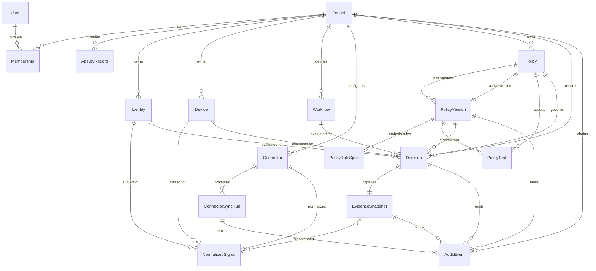

# SignalGrid Product Data Model (public-safe)

This document describes the entities and relationships of the product-shaped
SignalGrid core that lives in Review Hub as a **deterministic, fixture-backed,
public-safe** implementation. It is the data-model companion to the
[Product Core Foundation](PRODUCT_CORE_FOUNDATION.md) and is derived directly
from the type model in
[`lib/signalgrid-core/src/types.ts`](../lib/signalgrid-core/src/types.ts).

It is a **product-shaped review artifact, not the production core.** Every type
here describes deterministic, synthetic, fixture-backed data: there are no real
credentials, tenant identifiers, customer data, PHI/PII, or live vendor calls
anywhere in this module.

## Tenant isolation invariant

Every customer-owned entity carries a `tenant_id`, and every access is by
`object.id + tenant_id` — never by `object.id` alone. The tenant is always
derived from the authenticated principal (the key), never accepted from the
caller, which is what makes cross-tenant access structurally impossible. Reads
and evaluations that would cross a tenant boundary fail closed (`not_found` /
`cross_tenant_denied`), and audit chains never cross tenants.

This in-memory model **mirrors the durable schema the private production core
would use** (see the mapping to the launch plan below). The public core keeps
the same shapes, relationships, and isolation rules as the intended production
schema while storing only synthetic fixtures in memory.

Two entities are intentionally not tenant-scoped:

- `User` is a global principal record; a user's relationship to a tenant is
  expressed through `Membership`.
- `PolicyRuleSpec`, `MatchedRule`, and `DecisionEvidence` are embedded value
  objects that live inside their parent (`PolicyVersion`, `Decision`,
  `EvidenceSnapshot`) and inherit that parent's tenant scope.

## Entity–relationship diagram

> `PolicyTest` is being added to the core. It is included here as a child of
> `Policy` / `PolicyVersion` so the model reflects the intended shape; see the
> table below.

## Entities

### Tenancy & principals

**Tenant** — the isolation boundary. Every customer-owned row references it.

| field | type | notes |
| ----- | ---- | ----- |
| `id` | `string` | Tenant identifier; all access is scoped by this. |
| `slug` | `string` | Stable, URL-safe short name. |
| `name` | `string` | Display name. |
| `createdAt` | `string` | ISO timestamp (deterministic clock). |

**User** — a global principal record (not tenant-scoped).

| field | type | notes |
| ----- | ---- | ----- |
| `id` | `string` | User identifier. |
| `email` | `string` | Synthetic fixture address. |
| `displayName` | `string` | Display name. |

**Membership** — joins a `User` to a `Tenant` with a `Role`.

| field | type | notes |
| ----- | ---- | ----- |
| `id` | `string` | Membership identifier. |
| `tenantId` | `string` | Owning tenant. |
| `userId` | `string` | Referenced user. |
| `role` | `Role` | `owner` \| `admin` \| `operator` \| `auditor` \| `connector`. |

**ApiKeyRecord** — a public-safe fixture key mapping a token to a principal. No
real secret is stored.

| field | type | notes |
| ----- | ---- | ----- |
| `id` | `string` | Key record identifier. |
| `tenantId` | `string` | Owning tenant. |
| `principalType` | `PrincipalType` | `user` \| `service`. |
| `subjectId` | `string` | Subject the key acts as. |
| `role` | `Role` | Granted role. |
| `token` | `string` | Synthetic demo token; public-safe, not a real credential. |
| `keyReference` | `string` | Non-secret display reference for the presented key. |

> The `Principal` type (`tenantId`, `principalType`, `subjectId`, `role`,
> `keyReference`) is the resolved, in-memory identity derived from an
> `ApiKeyRecord` at authentication time. `Role` and `Permission` drive a
> deny-by-default RBAC matrix.

### Subjects: identity, device, workflow

**Identity** — a tenant-scoped principal observed through the connector.

| field | type | notes |
| ----- | ---- | ----- |
| `id` | `string` | Identity identifier. |
| `tenantId` | `string` | Owning tenant. |
| `externalRef` | `string` | Reference into the source system. |
| `displayName` | `string` | Display name. |
| `state` | `IdentityState` | `enabled` \| `disabled` \| `unknown`. |
| `assignedRole` | `string` | Role assigned in the source system. |

**Device** — a tenant-scoped device observed through the connector.

| field | type | notes |
| ----- | ---- | ----- |
| `id` | `string` | Device identifier. |
| `tenantId` | `string` | Owning tenant. |
| `externalRef` | `string` | Reference into the source system. |
| `name` | `string` | Display name. |
| `osPlatform` | `string` | Operating system platform. |
| `osVersion` | `string` | Operating system version. |
| `ownerType` | `OwnerType` | `corporate` \| `personal` \| `shared` \| `unknown`. |
| `managementAgent` | `ManagementAgent` | `intune` \| `jamf` \| `workspace_one` \| `unknown`. |

**Workflow** — a tenant-scoped protected action with a risk tier.

| field | type | notes |
| ----- | ---- | ----- |
| `id` | `string` | Workflow identifier. |
| `tenantId` | `string` | Owning tenant. |
| `key` | `string` | Stable lookup key used by evaluate requests. |
| `name` | `string` | Display name. |
| `riskTier` | `RiskTier` | `low` \| `standard` \| `elevated` \| `critical`. |

### Connector & signals

**Connector** — a fixture-only, read-only connector instance.

| field | type | notes |
| ----- | ---- | ----- |
| `id` | `string` | Connector identifier. |
| `tenantId` | `string` | Owning tenant. |
| `kind` | `ConnectorKind` | `microsoft-entra-intune`. |
| `mode` | `ConnectorMode` | `fixture` (no live vendor call). |
| `permissionScope` | `string` | Read-only least-privilege scope, documented not exercised. |
| `credentialRef` | `string` | Placeholder pointer to where a real credential reference would live in the private core. Not a secret and not a real reference. |
| `status` | `ConnectorStatus` | `healthy` \| `degraded` \| `never_synced`. |
| `lastSyncAt` | `string \| null` | Last successful sync time. |

**ConnectorSyncRun** — one fixture sync execution.

| field | type | notes |
| ----- | ---- | ----- |
| `id` | `string` | Sync run identifier. |
| `tenantId` | `string` | Owning tenant. |
| `connectorId` | `string` | Parent connector. |
| `startedAt` | `string` | Start timestamp. |
| `completedAt` | `string` | Completion timestamp. |
| `status` | `SyncStatus` | `success` \| `partial` \| `failed`. |
| `recordsProcessed` | `number` | Raw records read from the fixture. |
| `signalsNormalized` | `number` | Signals produced. |
| `note` | `string` | Human-readable summary. |

**NormalizedSignal** — a normalized posture observation about a subject.

| field | type | notes |
| ----- | ---- | ----- |
| `id` | `string` | Signal identifier. |
| `tenantId` | `string` | Owning tenant. |
| `connectorId` | `string` | Producing connector. |
| `subjectType` | `SubjectType` | `device` \| `identity`. |
| `subjectId` | `string` | The `Device` or `Identity` observed. |
| `category` | `SignalCategory` | `identity_state` \| `device_compliance` \| `device_management` \| `device_encryption` \| `os_support` \| `posture_freshness` \| `custody_state` \| `charge_state` \| `tamper_state` \| `dock_state` \| `security_baseline` \| `badge_binding`. |
| `value` | `string \| number \| boolean \| null` | Normalized value. |
| `observedAt` | `string` | When the source observed it. |
| `freshness` | `Freshness` | `fresh` \| `stale` \| `expired` \| `missing` \| `unknown`. |
| `sourceReference` | `string` | Reference back to the source record. |

### Policy & versions

**Policy** — a named, tenant-scoped policy with a pointer to its active version.

| field | type | notes |
| ----- | ---- | ----- |
| `id` | `string` | Policy identifier. |
| `tenantId` | `string` | Owning tenant. |
| `key` | `string` | Stable lookup key. |
| `name` | `string` | Display name. |
| `description` | `string` | What the policy governs. |
| `workflowPattern` | `string` | Which workflows the policy applies to. |
| `activeVersionId` | `string` | The currently active `PolicyVersion`. |

**PolicyVersion** — an immutable, content-digested version of a rule set.

| field | type | notes |
| ----- | ---- | ----- |
| `id` | `string` | Version identifier. |
| `tenantId` | `string` | Owning tenant. |
| `policyId` | `string` | Parent policy. |
| `version` | `number` | Monotonic version number. |
| `status` | `PolicyVersionStatus` | `active` \| `superseded` \| `draft`. |
| `rules` | `PolicyRuleSpec[]` | Ordered, embedded rule specs. |
| `createdAt` | `string` | Creation timestamp. |
| `digest` | `string` | Deterministic content digest of the rule set (tamper-evidence). |

**PolicyRuleSpec** — an embedded, typed rule. Fires when **all** conditions
hold (logical AND); the engine is most-restrictive-wins and fail-closed.

| field | type | notes |
| ----- | ---- | ----- |
| `id` | `string` | Rule identifier (unique within the version). |
| `description` | `string` | Human-readable intent. |
| `match` | `RuleCondition[]` | Typed conditions over `EvidenceField`s; all must hold. |
| `outcome` | `DecisionOutcome` | `allow` \| `step_up` \| `restrict` \| `deny`. |
| `reasonCode` | `string` | Machine-readable reason emitted on match. |
| `severity` | `Severity` | `low` \| `medium` \| `high` \| `critical`. |

**PolicyTest** *(being added)* — a pinned assertion that a given evidence input
produces an expected outcome under a specific policy version. Included here as a
child of `Policy` / `PolicyVersion` so the model reflects its intended shape.

| field | type | notes |
| ----- | ---- | ----- |
| `id` | `string` | Test identifier. |
| `tenantId` | `string` | Owning tenant. |
| `policyId` | `string` | Parent policy. |
| `policyVersionId` | `string` | Policy version the test is pinned to. |
| `name` | `string` | Human-readable case name. |
| `evidence` | `DecisionEvidence` | Synthetic evidence input for the case. |
| `expectedOutcome` | `DecisionOutcome` | Asserted outcome. |
| `expectedReasonCodes` | `string[]` | Asserted reason codes. |

> This mirrors `policy_tests` in the launch plan's durable schema. Fields are
> illustrative of the intended shape; treat the type model in `types.ts` as
> authoritative once the entity lands there.

### Decisions, evidence & audit

**Decision** — the immutable outcome of one evaluation of the decision loop.

| field | type | notes |
| ----- | ---- | ----- |
| `id` | `string` | Decision identifier (deterministic). |
| `tenantId` | `string` | Owning tenant. |
| `identityId` | `string` | Subject identity. |
| `deviceId` | `string` | Subject device. |
| `workflowId` | `string` | Requested workflow. |
| `outcome` | `DecisionOutcome` | `allow` \| `step_up` \| `restrict` \| `deny`. |
| `policyId` | `string` | Governing policy. |
| `policyVersionId` | `string` | Applied policy version. |
| `policyVersion` | `number` | Applied version number (denormalized). |
| `matchedRules` | `MatchedRule[]` | Rules that fired (embedded). |
| `reasonCodes` | `string[]` | Reason codes for the outcome. |
| `signalIds` | `string[]` | Signals considered. |
| `evidenceSnapshotId` | `string` | The captured evidence snapshot. |
| `requestContext` | `Record<string,string>` | Non-secret request context. |
| `latencyMs` | `number` | Evaluation latency. |
| `createdAt` | `string` | Creation timestamp. |
| `reviewStatus` | `ReviewStatus` | `not_required` \| `pending_review` \| `reviewed`. |
| `reviewable` | `boolean` | Whether the decision is flagged for human review. |
| `explanation` | `string` | Human-readable explanation. |

> `MatchedRule` (`ruleId`, `reasonCode`, `outcome`, `severity`) is embedded in
> the decision. `DecisionEvidence` is the normalized, fail-closed context the
> engine tested — missing inputs resolve to `unknown` / `missing`, never to a
> healthy value. Its dimensions are: `identityEnabled`, `deviceManaged`,
> `deviceCompliance`, `deviceEncrypted`, `osSupported`, `ownerType`,
> `postureFreshness`, `workflowRiskTier`, the physical-custody fields
> `custodyState` / `dockChargeState` / `tamperState`, the security-baseline field
> `baselineCompliance` (`BaselineState`: `aligned` \| `partial` \| `drifted` \|
> `not_assessed` \| `unknown` — see
> [Security-Baseline Alignment](SECURITY_BASELINE_ALIGNMENT.md)), the
> badge-binding field `badgeBinding` (`BadgeBindingState`: `present` \|
> `removed` \| `forced` \| `absent` \| `unknown` — the RFID/prox reader case's
> person→shared-device binding; see
> [Credential-Reader Signal Model](CREDENTIAL_READER_SIGNAL_MODEL.md)), and the
> derived `criticalSignalsPresent`.

**EvidenceSnapshot** — an immutable, reproducible, content-digested record of
exactly what the engine saw.

| field | type | notes |
| ----- | ---- | ----- |
| `id` | `string` | Snapshot identifier. |
| `tenantId` | `string` | Owning tenant. |
| `decisionId` | `string` | Decision this snapshot backs. |
| `capturedAt` | `string` | Capture timestamp. |
| `evidence` | `DecisionEvidence` | The normalized evidence the engine tested. |
| `signalsUsed` | `NormalizedSignal[]` | Full copies of the signals considered. |
| `policyVersionId` | `string` | Policy version applied. |
| `policyVersion` | `number` | Version number (denormalized). |
| `sourceReferences` | `string[]` | Source references for the signals. |
| `digest` | `string` | Deterministic content digest making the snapshot tamper-evident. |

**AuditEvent** — an append-only, per-tenant, digest-chained ledger entry.

| field | type | notes |
| ----- | ---- | ----- |
| `id` | `string` | Event identifier. |
| `tenantId` | `string` | Owning tenant (chains never cross tenants). |
| `seq` | `number` | Monotonic sequence within the tenant chain. |
| `type` | `AuditEventType` | `decision.evaluated` \| `connector.synced` \| `policy.version_activated` \| `evidence.captured`. |
| `actor` | `string` | Who/what caused the event. |
| `subject` | `string` | What the event is about. |
| `summary` | `string` | Human-readable summary. |
| `references` | `string[]` | Related object references. |
| `recordedAt` | `string` | Record timestamp. |
| `prevDigest` | `string` | Digest of the previous event in this tenant's chain (`"genesis"` if first). |
| `digest` | `string` | Digest over `prevDigest` + canonical event body. |

## Tamper-evidence model

Two mechanisms make the record reviewable and tamper-evident:

- **Evidence snapshot content digest.** Each `EvidenceSnapshot` (and each
  `PolicyVersion`) carries a `digest` computed deterministically over its
  canonical content. Recomputing the digest and comparing it to the stored
  value detects any mutation of the captured evidence or rule set. Mutating a
  snapshot fails its digest check.

- **Per-tenant digest-chained audit ledger.** `AuditEvent`s form an append-only
  chain per tenant. Each event stores `prevDigest` (the previous event's
  `digest`, or `"genesis"` for the first) and a `digest` computed over
  `prevDigest` + the canonical event body (`prevDigest → digest`). Any mutation
  or reordering breaks the chain and is detected at the broken `seq`. Chains are
  strictly per-tenant and never cross tenant boundaries.

The `digest` is a **deterministic content digest for review, not a cryptographic
guarantee.** It demonstrates the integrity and chaining properties of the model;
the private production core would use a keyed cryptographic construction (for
example an HMAC or signature chain) to make the ledger cryptographically
tamper-evident.

## Mapping to the launch plan data model

This model realizes the durable schema outlined in the
[Realistic Launch Plan](REALISTIC_LAUNCH_PLAN.md#data-model) as an in-memory,
public-safe form. Correspondences:

| Launch-plan table | Model entity | Notes |
| ----------------- | ------------ | ----- |
| `tenants` | `Tenant` | Isolation boundary. |
| `users` | `User` | Global principal record. |
| `memberships` | `Membership` | User ↔ tenant with role. |
| `roles` | `Role` / RBAC matrix | Enum + deny-by-default permission matrix. |
| `api_keys` | `ApiKeyRecord` | Synthetic fixture tokens only. |
| `connector_instances` | `Connector` | Fixture-only, read-only. |
| `connector_credential_refs` | `Connector.credentialRef` | Placeholder pointer, not a secret. |
| `connector_sync_runs` | `ConnectorSyncRun` | Sync history. |
| `connector_events_raw` | *(not materialized)* | Raw events are consumed into normalized signals in the fixture connector. |
| `identities` | `Identity` | Subject. |
| `devices` | `Device` | Subject. |
| `workflows` | `Workflow` | Protected action + risk tier. |
| `normalized_signals` | `NormalizedSignal` | Normalized posture. |
| `policies` | `Policy` | Named policy + active version pointer. |
| `policy_versions` | `PolicyVersion` | Immutable, digested. |
| `policy_rules` | `PolicyRuleSpec` | Embedded in the version. |
| `policy_tests` | `PolicyTest` *(being added)* | Pinned assertions per version. |
| `decisions` | `Decision` | Immutable outcome. |
| `decision_signal_evidence` | `EvidenceSnapshot` | Content-digested capture. |
| `decision_explanations` | `Decision.explanation` | Denormalized onto the decision. |
| `audit_events` | `AuditEvent` | Per-tenant digest chain. |
| `remediation_actions` | *(not in the public core)* | Approval-gated, human-owned; outside this public-safe scope. |
| `webhook_deliveries` | *(not in the public core)* | Delivery/egress belongs to the private production core. |

Consistent with `AGENTS.md`, entities tied to real credentials, live vendor
calls, durable persistence, egress, and approval-gated remediation are
deliberately absent from this public core and belong to the private production
core and to human-owned decisions.
