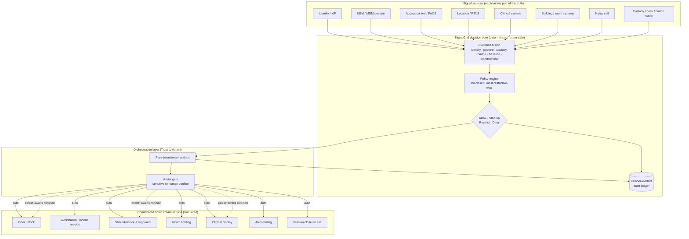

# SignalGrid — The Trust Fabric for the Smart Hospital

> Vision + architecture for the context-aware trust & orchestration layer, and
> the phased prototype that demonstrates it. Public-safe throughout: synthetic
> fixtures only, no employer data, no live systems. SignalGrid **assists and
> coordinates; it never silently overrides a clinician** or becomes an
> uncontrolled dependency for life-safety systems.

## Problem statement

A hospital already runs many systems that each know *part* of the truth:

- **Identity** knows who the person is.
- **UEM / MDM** knows whether the device is enrolled and compliant.
- **Access control** knows whether a door may open.
- **Location / RTLS** knows where the person or device is.
- **The clinical system** knows the patient, the assignment, and the workflow.
- **Building systems** know the room, lighting, displays, and environment.
- **Nurse call** knows that assistance is needed.

Yet these systems don't talk to each other at the moment it matters, so the
**human** is forced to coordinate all of them by hand — badge in, sign in,
unlock, search for the right chart, configure the room, and repeat the same
identity proof across six disconnected tools, many times per shift. The signals
exist; nothing fuses them into a single trusted action.

**SignalGrid closes that gap.** At the moment a workflow fires on a shared,
mobile, or frontline device, it correlates those signals and answers one
question:

> *Who is this person, what are they authorized to do, where are they, what
> workflow are they performing, and what should happen next?*

Their **trusted presence becomes the signal that starts the workflow** — while
every action stays policy-controlled, auditable, and subject to clinical
judgment.

The core equation, and the layer this build adds on top of it:

```
Identity + Device + Workflow + Context  =  Trust
Trust + Orchestration                   =  Action
```

## The safe decision model

The decision core returns one of four verdicts; the orchestration layer adds a
fifth *behavior*, **Assist**, so that sensitive actions are prepared but never
performed without a human:

| Verdict / behavior | Meaning |
| ------------------ | ------- |
| **Allow** | Conditions are trusted; the workflow proceeds. |
| **Step-up** | Require a badge tap, biometric, or another control before proceeding. |
| **Restrict** | Limit to safe ambient preparation; hold access actions. |
| **Deny** | Prevent the action and explain why. |
| **Assist** *(orchestration)* | Prepare the environment, but **require explicit human confirmation** for sensitive actions (a controlled-room door, a PHI display). |

This is the design principle that keeps it safe in a clinical setting: **human-
centered, context-aware orchestration that removes repetitive friction while
preserving explicit controls, auditability, and clinical judgment.** Not "fully
automate everything."

## Architecture



**What's built today (Phase 1):** the decision core and the orchestration layer
are real and runnable. The signal sources and downstream actions are *simulated*
against synthetic fixtures — the model is proven end-to-end without touching a
real hospital, a commercial UEM tenant, or protected data.

## The phased prototype

### Phase 1 — Trusted room entry ✅ (built, runnable)
A synthetic nurse with a managed device approaches a room. SignalGrid evaluates
identity, role, on-shift, device compliance, assignment, location, room
sensitivity, and workflow, and returns **Allow / Step-up / Restrict / Deny**.
Run it: [`RUN_ON_MAC.md`](./RUN_ON_MAC.md). Proven by `proof:orchestration`
(20/20) + API integration coverage.

### Phase 2 — Workflow orchestration ✅ (built, runnable)
Once access is decided, SignalGrid orchestrates simulated downstream actions —
unlock door, start workstation/mobile session, assign the shared device, set
lighting, activate the clinical display, route alerts, arm session-close on exit
— each **auto** or, when sensitive, **assist** (human-confirmed).

### Phase 3 — Operational intelligence ✅ (built, runnable)
The console shows, per entry: the signals evaluated → the decision → *why* → the
downstream systems triggered → where anything was held or blocked. Open
`http://localhost:8080/console`.

### Beyond the prototype (roadmap, not built)
Real signal-source connectors (behind the tier gate, beta/prod only), additional
workflows (medication administration, specimen handling, shift hand-off), RTLS
location, and a policy authoring surface for the orchestration rules.

## What this is / is not

- **Is:** a working demonstration that identity + device + custody + baseline +
  workflow risk can fuse into one trusted decision, and that a decision can
  safely coordinate the physical environment with a human in the loop.
- **Is not:** production-ready, compliance-certified, or a replacement for IAM,
  UEM, access control, nurse call, or clinical systems. It runs on synthetic
  fixtures and must stay separate from any employer's data, tenants, and
  workflows. High-risk actions are simulated and human-confirmed.
