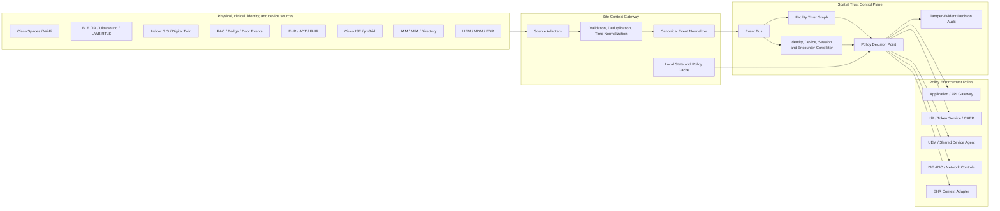
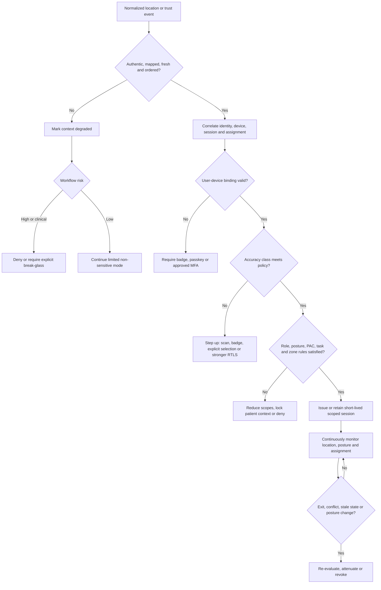

# Spatial trust & session control — external research report (intake row 17)

*Provenance: an owner-supplied deep-research report, submitted 2026-07-31 and
assessed as `docs/INTAKE_LEDGER.md` row 17. Committed verbatim below as the
durable source artifact for that row — an external reference we learn framing
from, per this folder's charter: not claims, not endorsements, not
partnerships, and nothing here implies certification or affiliation with any
named vendor. The inline `citeturn...` markers are citation artifacts from
the research tool that produced the report and are preserved as-is.*

*Disposition (full detail in the ledger): the report's central rule and nearly
all mechanics were already built as `@workspace/facility-trust-graph` phases
1–3; its one genuine mechanical gap — the geofence entry/exit state machine
(dwell, grace, hysteresis) — was built as `transition.ts`; CAEP/Shared Signals
and TAP-style bootstrap credentials are positioned as roadmap.*

---

# Designing a Location-Aware Spatial Trust and Session-Control System

## Executive summary

A location-aware trust platform should not treat a Wi‑Fi coordinate, badge swipe, or real-time location system observation as authentication. The correct model is a **continuous, evidence-fusion authorization system** in which physical location is evaluated together with authenticated identity, device posture, session state, clinical assignment, access-control events, spatial-map version, source health, and workflow risk. This follows NIST zero-trust guidance, which explicitly states that neither physical/network location nor enterprise ownership of a device creates implicit trust. citeturn19view18

The recommended design has five core properties:

1. **A vendor-neutral Facility Trust Graph is the spatial system of record.** Cisco Spaces, RTLS platforms, ArcGIS Indoors, PAC systems, and EHR location codes are mapped to stable internal site, building, floor, unit, room, bed, doorway, and security-zone identifiers. Cisco Spaces already models campuses, buildings, floors, maps, and zones, while ArcGIS Indoors provides facilities, levels, units, details, occupants, sites, and areas. FHIR `Location.partOf` can represent healthcare location hierarchy, including rooms and beds. citeturn13search5turn19view7turn20view9turn20view10

2. **Raw coordinates are converted into graded accuracy classes.** Cisco describes `DEVICE_LOCATION_UPDATE` as an approximate location event and returns map-relative coordinates plus a confidence factor expressed as error in feet. Room or bed automation therefore requires stronger evidence than Wi‑Fi coordinates alone. Dedicated healthcare RTLS products can add room, bay, or bed separation using infrared, ultrasound, or multimode sensing. citeturn19view0turn13search5turn19view4turn19view5turn19view6

3. **Location may initiate or attenuate a session, but it should not independently authenticate one.** Entering a permitted zone can pre-stage applications, offer a badge-login prompt, or exchange a limited token for a more capable one after identity and device checks. Leaving a zone can reduce scopes, close patient context, require step-up authentication, or revoke the session. Cisco ISE and pxGrid can supply authenticated network sessions, posture, endpoint profiles, MDM attributes, Security Group Tags, and network enforcement actions; OpenID CAEP can carry session-revocation, assurance-change, and device-compliance events to cooperating applications. citeturn19view2turn18search12turn19view3turn18search6turn20view5

4. **Critical decisions should remain available locally.** Cloud deployment is reasonable for approved commercial environments, but healthcare, government, disconnected, or sensitive sites should use an on-site context gateway and policy decision point. Patient joins, precise personnel movement, PAC events, and restricted-zone decisions can remain local, with only pseudonymous or aggregate data sent to a central service. Cisco Spaces for Government received FedRAMP Moderate authorization effective November 26, 2025, but an integrated solution still needs its own documented authorization boundary, data flows, customer responsibilities, and agency risk acceptance. citeturn19view16turn19view17turn14search37

5. **BYOD controls should govern the enterprise workspace rather than the owner’s personal device use.** Android personally owned work profiles separate work and personal applications and data, while Apple User Enrollment limits management to organizational accounts, settings, and information. Because an Android user can pause the work profile, the mobile platform’s current managed state must be checked rather than assumed from location. citeturn20view1turn20view2turn19view13

The exact facility size, number of sites, device population, clinical application set, PAC vendor mix, network density, RTLS infrastructure, and required decision latency are **unspecified**. Consequently, this report defines an architecture and control model but does not prescribe final capacity, radio-density, retention, latency, or availability values. Those must be established through site surveys, workflow hazard analysis, and pilot measurements.

## Architecture and trust patterns

The platform should separate **observation**, **correlation**, **decision**, and **enforcement**. This avoids allowing any individual vendor feed to directly modify a user session or patient context.



Cisco Spaces Firehose is suitable as a high-volume observation source. Its event catalog includes device-location, device-presence, user-presence, association, occupancy, asset-location, network-status, and topology-related events. Cisco recommends presence events when an application needs site-, floor-, or zone-level presence rather than raw coordinates. Its streaming schema can evolve by adding fields, so adapters should tolerate unknown properties and preserve the original payload for troubleshooting. citeturn13search18turn19view0turn13search24

Cisco ISE should contribute network-session and device-trust context rather than indoor geometry. Its pxGrid session representation can include username, MAC and IP addresses, session state, network attachment point, authorization profiles, posture status, endpoint profile, operating system, TrustSec group, MDM registration, compliance, encryption, root/jailbreak status, PIN state, serial number, and MDM synchronization time. pxGrid can stream active-session changes and invoke Adaptive Network Control actions for wired and wireless endpoints. citeturn19view2turn18search21turn19view3

The indoor GIS should own curated geometry and topology. ArcGIS Indoors can maintain floor-aware facilities, levels, units, details, sites, areas, and occupants, and OGC IndoorGML provides an open model oriented around indoor spaces and navigation relationships. Neither should be assumed to contain current device position unless coupled with an indoor positioning or RTLS service. citeturn19view7turn18search1turn20view0

PAC platforms should supply credential, reader, doorway, area, grant/deny, and time evidence. Genetec’s SDK supports access-control event queries, and Genetec models doors as access points into or out of secured areas. LenelS2 OnGuard integrations can expose events through OpenAccess REST services and a SignalR event bridge, although at least some documented integrations use transient subscriptions and therefore require reconnect and gap-recovery handling. citeturn18search11turn5search9turn5search17turn19view8

A PAC event proves that a credential was presented and processed; it does **not necessarily prove** that the credential owner crossed the doorway, remained in the room, or carried a particular device. That conclusion is an architectural inference from the nature of credential, reader, and door events. A higher-confidence crossing should combine the PAC event with directional door topology, a subsequent RTLS or network transition, an authenticated device session, and time consistency.

**Recommended architectural patterns**

| Pattern | Purpose | Design consequence |
|---|---|---|
| Source-adapter pattern | Isolate Cisco, RTLS, PAC, GIS, EHR, IAM, and UEM schemas | No vendor identifier becomes a core primary key |
| Event-sourcing pattern | Retain ordered observations and derived decisions | Supports replay, forensics, revised map interpretation, and audit |
| Digital-twin-plus-graph pattern | Combine geometry with semantic and security relationships | Policies can reason over rooms, beds, doors, adjacency, classification, and routes |
| Policy decision/enforcement separation | Keep business policy independent of applications | The same decision can control an EHR, API gateway, shared device, IdP, or ISE |
| Local-first critical path | Preserve clinical and security operation during WAN/cloud loss | Local policy, identity cache, map, clock, audit, and enforcement are required |
| Continuous access evaluation | Reassess existing sessions when location, posture, role, or assignment changes | Sessions can be attenuated or revoked without waiting for normal token expiry |
| Privacy boundary pattern | Join PHI and precise personnel location only where necessary | Cloud analytics can receive coarse or pseudonymous outputs rather than raw movement |

OpenID’s final CAEP specification is particularly relevant because it is designed to let cooperating systems attenuate access to users, devices, sessions, and applications as conditions change. OAuth token introspection can provide active-state checks for tokens, while short-lived or revocable sessions avoid the problem of an application continuing to trust a long-lived bearer token after a geofence or posture transition. citeturn20view5turn20view7

## Facility Trust Graph and canonical events

The Facility Trust Graph should be a **temporal, versioned graph** rather than a single floor-plan database. Geometry answers “where”; graph relationships answer “what this area means, how it is entered, which patient bed it contains, and what policies apply.”

**Principal node types**

| Domain | Proposed node types |
|---|---|
| Spatial | Organization, site, campus, building, floor, unit, security zone, room, bay, bed, corridor, portal, door, elevator, stair, muster area |
| Sensors | Access point, antenna, BLE gateway, IR/ultrasound exciter, UWB anchor, badge reader, door controller |
| Identity | Person, workforce identity, role, group, shift, credential, badge, authenticator |
| Device | Device, asset, RTLS tag, UEM record, network endpoint, device class, device security tier |
| Clinical | Patient pseudonym, encounter, care team, assignment, task, FHIR Location, EHR bed code |
| Session | Device session, application session, patient-context session, shared-device checkout, temporary-authentication grant |
| Policy | Geofence, permitted-role rule, minimum posture, location-accuracy requirement, data-egress rule, emergency override |

**Principal edge types**

```text
PART_OF              Room → Unit → Floor → Building → Site
ADJACENT_TO          Room ↔ Corridor
REACHABLE_VIA        Space → Door → Space
SECURED_BY           Door → Reader / Controller
OBSERVED_BY          Space → AP / RTLS sensor
MAPS_TO              Internal space → Cisco / GIS / PAC / FHIR identifier
ASSIGNED_TO          Person → Shift / Unit / Task
AUTHENTICATED_ON     Person → Device session
CHECKED_OUT_TO       Shared device → Person
LOCATED_AT           Person / device / asset → Space observation
PERMITTED_IN         Role / device tier → Security zone
CARING_FOR           Practitioner / care team → Encounter
OCCUPIES             Encounter → Bed
BOUND_TO             Device → RTLS tag / certificate / UEM record
GOVERNED_BY          Space / session / workflow → Policy
```

FHIR is well suited to the clinical side of this mapping. `Location.partOf` represents one location as physically part of another, and the specification gives examples that include rooms, beds, and movable trolleys. `Encounter.location.period` records the time during which a patient was present at a location. This supports mapping EHR room and bed assignments into the graph without making the EHR responsible for radio positioning. citeturn20view9turn20view10turn20view12

Every spatial object should have an internal immutable identifier and effective-time metadata:

```text
space_id
geometry_version
topology_version
policy_version
valid_from
valid_until
source_system
source_identifier
source_last_verified
classification
patient_capacity
minimum_accuracy_class
minimum_device_tier
cloud_egress_rule
emergency_behavior
```

This versioning is critical. A device coordinate calculated against floor map version A must not be evaluated against room polygons from version B after a wall, doorway, unit, or bed-layout change.

### Canonical location observation

The following is a proposed normalized event contract. It deliberately separates the observed subject, spatial result, uncertainty, source provenance, user-device binding, and privacy classification.

```json
{
  "specVersion": "1.0",
  "eventId": "01J4P1WY6VZ7KET9S34TFY1P8A",
  "eventType": "spatial.location.observed",
  "source": {
    "system": "cisco-spaces",
    "tenantId": "spaces-tenant-7d2f",
    "sourceEventId": "evt-dlu-001",
    "adapterVersion": "3.2.1"
  },
  "time": {
    "observedAt": "2026-07-31T14:32:17.421Z",
    "receivedAt": "2026-07-31T14:32:17.697Z",
    "normalizedAt": "2026-07-31T14:32:17.706Z",
    "sequence": 884219
  },
  "subject": {
    "type": "device",
    "internalId": "dev-wow-00442",
    "sourceIdentifiers": [
      {
        "type": "ciscoDeviceId",
        "value": "dev-abc-12345"
      }
    ],
    "deviceClass": "workstation-on-wheels",
    "securityTier": "clinical-managed-high"
  },
  "location": {
    "spaceId": "site-a.bldg-1.floor-3.unit-icu.room-312.bed-b",
    "parentSpaceId": "site-a.bldg-1.floor-3.unit-icu.room-312",
    "mapId": "cisco-map-9308",
    "mapVersion": "2026-07-14T22:00:00Z",
    "coordinates": {
      "x": 183.42,
      "y": 71.06,
      "coordinateSystem": "vendor-floor-local"
    },
    "accuracyClass": "room_candidate",
    "reportedErrorMeters": 8.2,
    "containmentProbability": 0.74,
    "transition": "entered"
  },
  "binding": {
    "activeUserId": "workforce-pseudonym-91c4",
    "sessionId": "session-c4d9",
    "bindingMethod": "badge-tap-plus-sso",
    "bindingConfidence": "high",
    "bindingExpiresAt": "2026-07-31T14:42:17Z"
  },
  "evidence": [
    {
      "type": "wifi-location",
      "source": "cisco-spaces",
      "freshnessMs": 285,
      "weight": 0.45
    },
    {
      "type": "network-session",
      "source": "cisco-ise-pxgrid",
      "freshnessMs": 1310,
      "weight": 0.25
    },
    {
      "type": "pac-door-grant",
      "source": "genetec",
      "freshnessMs": 7200,
      "weight": 0.15
    }
  ],
  "quality": {
    "sourceHealth": "healthy",
    "clockStatus": "synchronized",
    "mapStatus": "current",
    "duplicate": false,
    "lateEvent": false
  },
  "privacy": {
    "classification": "precise-workforce-location",
    "purpose": "active-clinical-session-control",
    "retentionPolicy": "raw-24h-derived-30d",
    "offDutyCollectionAllowed": false,
    "phiPresent": false
  }
}
```

The canonical contract should retain Cisco’s source identifiers and confidence information without exposing raw MAC addresses throughout the platform. Cisco’s own sample event includes record identifiers, timestamps, tenant identifiers, device identity, user identity, location information, and confidence data, while its REST location response describes `confidenceFactor` as an error distance in feet. citeturn19view1turn13search5

A separate decision event prevents source observations from being mistaken for authorization:

```json
{
  "specVersion": "1.0",
  "eventId": "01J4P1X1ASVZPN9Y4B9M99VV33",
  "eventType": "spatial.access.decision",
  "decisionId": "dec-3cb72f",
  "subjectId": "workforce-pseudonym-91c4",
  "deviceId": "dev-wow-00442",
  "sessionId": "session-c4d9",
  "resource": {
    "type": "ehr-workflow",
    "id": "medication-administration"
  },
  "context": {
    "spaceId": "site-a.bldg-1.floor-3.unit-icu.room-312.bed-b",
    "accuracyClass": "bed_confirmed",
    "devicePosture": "compliant",
    "role": "registered-nurse",
    "assignmentMatch": true,
    "patientConfirmation": "wristband-scanned"
  },
  "decision": {
    "outcome": "allow",
    "sessionMode": "clinical-bedside",
    "grantedScopes": [
      "patient.read.assigned",
      "medication.administer"
    ],
    "expiresInSeconds": 180,
    "continuousEvaluationRequired": true
  },
  "policy": {
    "policyId": "clinical-med-admin-v18",
    "policyVersion": "18.4",
    "reasonCodes": [
      "LOCATION_BED_CONFIRMED",
      "DEVICE_COMPLIANT",
      "ROLE_AUTHORIZED",
      "ASSIGNMENT_MATCH",
      "PATIENT_EXPLICITLY_CONFIRMED"
    ]
  }
}
```

## Decision logic and workflow controls

Location classification should not be a direct translation of one vendor’s confidence score. It should combine geometry, error radius, sensor technology, containment, freshness, map validity, number of independent sources, and movement continuity.

### Accuracy classes and automation authority

| Accuracy class | Minimum interpretation | Appropriate maximum automation | Prohibited use by itself |
|---|---|---|---|
| `unknown` | No current or trustworthy location | Generic remote access policy; explicit login | Any geofence-driven privilege |
| `site` | Subject is probably at a particular campus/site | Site-specific notices and low-risk application routing | Clinical context or restricted-area access |
| `building` | Building containment is credible | Building application catalog, asset routing | Room or patient selection |
| `floor` | Floor containment is credible | Floor/unit workflow suggestions | Door, room, bed, or patient inference |
| `zone` | Department or broad geofence | Limited role elevation, unit dashboard, asset search | Multi-patient-room selection |
| `room_candidate` | Coordinate intersects a room, but error or RF behavior permits adjacent-room ambiguity | Prompt the user; pre-stage room workflow | Automatic patient context |
| `room_confirmed` | Room-contained signal or corroborated independent observations | Private-room workflow suggestion; room-specific controls | Medication, procedure, or specimen action without patient verification |
| `bed_candidate` | Most likely bed/bay, but competing candidate remains credible | Highlight likely bed and request confirmation | Automatic patient-specific action |
| `bed_confirmed` | Bed/bay-specific sensing or explicit scan, current map, and corroborated session | Preselect assigned patient and permit tightly scoped workflow | Treating location as sole clinical verification |

Cisco describes its continuous coordinate updates as approximate, so Wi‑Fi should normally produce site through `room_candidate` classes unless a validated deployment demonstrates stronger containment. Kontakt.io differentiates a BLE baseline of approximately 15–30 feet and 3–60 seconds latency from BLE-plus-infrared room certainty under five seconds. CenTrak’s Selective Certainty similarly combines zonal Wi‑Fi location with room certainty only in selected areas, while Securitas’ EX4300 can define as many as four zones for bays or beds in a multi-patient room. citeturn19view0turn19view4turn19view5turn19view6

The following chart is an **illustrative policy envelope**, not a measured vendor comparison:

```text
Maximum recommended automation authority

Site / building       ██░░░   Navigation and low-risk routing
Floor / zone          ███░░   Unit context and limited scope
Room candidate        ██░░░   Prompt or pre-stage only
Room confirmed        ████░   Room workflow; patient step-up remains
Bed candidate         ███░░   Suggest candidate; explicit confirmation
Bed confirmed         █████   Scoped bedside flow with identity,
                              posture, assignment and patient checks
```

### General decision algorithm



A policy evaluation can be represented as:

```text
decision =
  policy(
    authenticated_subject,
    active_role,
    device_identity,
    device_posture,
    session_binding,
    spatial_accuracy_class,
    spatial_freshness,
    source_diversity,
    zone_security_attributes,
    PAC_transition,
    current_assignment,
    encounter_location,
    workflow_risk,
    emergency_state
  )
```

### Geofence-based session start and stop

A geofence entry should normally **prepare** a session rather than authenticate it. On a managed workstation or workstation on wheels, a valid room or unit transition can wake the login agent, identify the appropriate application set, and request a badge tap or WebAuthn assertion. WebAuthn credentials are public-key credentials scoped to a relying party and bound to an authenticator, making them preferable to treating physical presence as an authentication factor. citeturn20view8

After successful authentication, the token service may issue a short-lived, zone-scoped session. An inside-geofence session might contain:

```text
role = clinician
zone = ICU-3
patient_scope = assigned-only
device_tier = clinical-managed
location_requirement = zone-or-better
continuous_evaluation = required
```

On exit, the system should not immediately revoke access from one missing radio observation. It should apply:

- A spatial hysteresis boundary.
- A dwell timer before declaring entry.
- An exit grace interval appropriate to the workflow.
- Multiple consecutive observations or an explicit doorway transition.
- Freshness and source-health checks.
- A “crossing,” “probably outside,” and “confirmed outside” state machine.

Once exit is confirmed, the response should depend on risk. Low-risk operational applications can continue. Clinical access can be reduced to assigned-patient summary or read-only mode. Sensitive-room privileges can be removed. Patient context should be closed, and high-risk sessions can be revoked through the IdP, reverse proxy, application integration, or CAEP event. OpenID CAEP is designed specifically for continuous changes affecting sessions, devices, assurance, and access. citeturn20view5turn15search8

Applications that cannot consume continuous signals should be placed behind a policy-enforcing gateway or use short access-token lifetimes. OAuth introspection can determine whether a token remains active and convey its authorization context to the protected resource. citeturn20view7

### Role-limited access outside the geofence

Leaving the authorized zone should not always equal total logout. A safer and more usable pattern is **scope attenuation**:

| Context | Example access |
|---|---|
| Inside assigned clinical zone, managed device, current posture | Assigned-patient workflow and unit operations |
| Elsewhere in the facility | Assigned-patient read-only summary; no local-room inference |
| Outside facility on compliant managed device | Remote-access role, strong MFA, no location-derived patient context |
| BYOD with managed work profile | Limited approved applications and application-protection controls |
| Unknown or noncompliant device | Public or low-sensitivity resources only |
| Restricted government enclave | Only enclave-approved device, local identity, and local application path |

This model complies more closely with zero-trust principles than “inside equals trusted; outside equals untrusted,” because subject, device, and resource are still independently authenticated and authorized. citeturn19view18

### BYOD work and personal mode

For Android BYOD, the work profile is a separate management domain for enterprise applications and data. Google states that policies on personally owned devices primarily apply to the work profile. Microsoft’s recommended configurations include work-profile passwords, profile lock timeouts, screen-capture controls, data-sharing restrictions, and profile wipe after excessive sign-in failures. citeturn20view1turn20view13

The recommended “mode switch” is therefore:

```text
Personal mode:
  Personal OS and apps remain under user control
  No continuous enterprise location collection
  Work applications paused, signed out or operating remotely

Work mode:
  User explicitly activates the work profile or enterprise app
  Enterprise session authenticates
  Device compliance is evaluated
  Location is collected only for declared work purposes
  Geofence may enable richer enterprise scopes
```

The platform should not promise that it can always force an Android work profile on merely because the user entered a facility; Android provides the user with a control to pause it. The policy must treat a paused profile as unavailable and fall back to a badge-equipped shared device, managed workstation, or explicit limited-access flow. citeturn20view2

Apple’s account-driven User Enrollment is explicitly designed for BYOD and limits management to organizational accounts, settings, and information, not the user’s personal account. Geofence controls should therefore be implemented through managed applications, identity conditional-access policy, per-app VPN, or an enterprise access proxy—not by attempting to take control of the personal side of the device. citeturn19view13

### Temporary MFA and recovery tokens

A temporary credential should be a **bootstrap or recovery mechanism**, not a standing substitute for strong authentication. Microsoft Entra Temporary Access Pass supports a time-limited passcode, optional one-time use, configurable activation time and duration, and REST-based administration. Its primary intended use is onboarding passwordless methods or recovering when a strong method is lost. citeturn19view15

A spatially assisted workflow should be:

1. The user requests temporary access.
2. Identity is verified through approved help-desk, manager, PIV/CAC, or in-person procedures.
3. PAC and geofence evidence may corroborate that the user is at an approved enrollment location, but location is not the sole verification factor.
4. The device must meet the enrollment or recovery posture policy.
5. A one-time, shortest-practical bootstrap pass is issued.
6. The pass can access only authenticator enrollment or recovery—not clinical data.
7. The user enrolls a passkey, smartcard, certificate, or other approved strong method.
8. The bootstrap credential is revoked or allowed to expire.
9. The entire process is audited.

For air-gapped environments, this role is performed by a local IdP or credential-management service using local trust roots, approved smartcards, controlled recovery codes, or locally issued short-lived credentials.

### Shared-device handoff

The architecture must separate four identities:

```text
Physical asset identity
Managed-device identity
Current human user
Current application and patient-context session
```

A badge tap or facial authentication can bind a user to a shared Android device, but handoff must terminate the prior user’s tokens, cached patient context, notifications, files, and application credentials. Imprivata documents shared-device checkout, badge or facial authentication, SSO, fast user switching, and credential clearing between users. citeturn19view14turn20view15

A safe handoff sequence is:

```text
User A requests handoff
→ freeze new transactions
→ commit or abandon in-progress work explicitly
→ close patient context
→ revoke User A app and refresh tokens
→ erase per-user cache and clipboard
→ release checkout binding
→ authenticate User B
→ evaluate User B role, assignment, posture and location
→ create a new isolated session
```

A device’s continued presence in a room must never preserve the previous user’s authority after logout, timeout, or checkout release.

### Multi-patient-room certainty

In a room with Bed A and Bed B, room presence is insufficient for patient selection. The minimum safe bedside decision should combine:

```text
bed_confirmed location
+ authenticated clinician
+ current user-device binding
+ compliant device
+ current care-team or task assignment
+ current EHR encounter-to-bed mapping
+ explicit patient verification for high-risk action
```

FHIR `Location` can represent hierarchical room and bed instances, and `Encounter.location.period` can represent when the patient was present there. Securitas can create multiple bay/bed RTLS zones with one exciter; CenTrak supports selective room certainty and multimode bed-level use cases; Kontakt.io distinguishes broad BLE proximity from rapid room-level BLE-plus-IR certainty. citeturn20view10turn20view12turn19view4turn19view5turn19view6

Even `bed_confirmed` should preselect rather than silently perform medication administration, specimen collection, procedure documentation, or order entry. A wristband scan, patient acknowledgment, or approved clinical confirmation remains necessary because RTLS can locate a device or tag but does not establish every clinical fact required for treatment.

## Deployment, resilience, security, and privacy

### Deployment modes

| Mode | Primary processing | Appropriate use | Key design constraints |
|---|---|---|---|
| Cloud-centric | Vendor clouds and central SaaS policy service | Commercial environments permitting location and identity metadata in approved SaaS | WAN dependency, vendor-region selection, cloud event latency, complete boundary review |
| Hybrid | Local gateway performs sensitive joins and critical decisions; central cloud manages policy and aggregate analytics | Hospitals, regulated enterprises, government moderate environments | Local cache, local policy decision point, pseudonymization, store-and-forward |
| On-premises | GIS, PAC, RTLS, ISE, EHR integration, policy and audit remain within facility | Highly controlled healthcare, sovereign, CUI, local-data-residency environments | Local HA, patch process, PKI, monitoring, backup and disaster recovery |
| Disconnected or air-gapped | No runtime external dependencies; signed offline update/import path | Classified, isolated, high-side, sensitive research or critical infrastructure | Local identity, time, maps, policy, logs, software repository, revocation and key management |

Cisco Spaces Firehose is cloud-oriented, while Cisco documentation also describes CMX-based on-premises location computation. An air-gapped design should therefore use a supported local Cisco or third-party location source rather than assuming the cloud Firehose will be available. The exact Cisco on-premises product, version, hardware lifecycle, capacity, and support status must be validated during procurement. citeturn13search7turn13search12

In hybrid mode, the local gateway should perform the sensitive correlation:

```text
precise staff location
+ badge identity
+ device session
+ patient encounter and bed
= local decision
```

The cloud may receive only:

```text
policy outcome
coarse zone
pseudonymous subject
device security tier
event latency
source health
reason codes
```

### FedRAMP and government boundary considerations

Cisco Spaces for Government’s FedRAMP Moderate authorization is relevant for agencies that can operate at that impact level, and Cisco states that the authorization became effective on November 26, 2025. It does not automatically authorize a larger solution composed of Cisco Spaces, RTLS, PAC, mobile agents, identity systems, EHR integrations, local gateways, and external analytics. citeturn19view16

FedRAMP requires an authorization boundary for the cloud service offering, and current FedRAMP guidance emphasizes boundary and data-flow documentation. The integrated design must therefore identify:

- Every component processing federal information or metadata.
- Every inbound and outbound interface.
- Cisco, RTLS, GIS, PAC, IAM, UEM, and notification dependencies.
- Administrative and monitoring planes.
- Mobile applications and embedded SDKs.
- Edge gateways and update services.
- Logging, backups, analytics, and support paths.
- Customer-responsible and inherited controls.
- Continuous-monitoring responsibilities.

FedRAMP’s agency-authorization resources explicitly identify authorization-boundary guidance as part of the package, while FedRAMP’s system-security-plan guidance states that the boundary diagram should show all system components and external services used to operate or manage the offering. citeturn19view17turn14search37

A disconnected mode additionally needs:

```text
Local policy administration and signed policy bundles
Local IdP, MFA, certificate validation and revocation
Local NTP or approved trusted time source
Local GIS and location engine
Local PAC, EHR and RTLS adapters
Local immutable audit and SIEM
Offline software and vulnerability-update process
Controlled removable-media or one-way transfer procedures
Tested loss-of-connectivity workflows
```

### Failure modes and safe defaults

| Failure or attack | Risk | Recommended safe default |
|---|---|---|
| Location event becomes stale | User or device may have moved | Stop using location-derived elevation; retain only explicitly remote-safe access |
| RF floor bleed or adjacent-room jump | Wrong room or patient context | Downgrade to `room_candidate`; require explicit selection or stronger sensor |
| Conflicting Cisco, RTLS, and PAC observations | Sensor error, tailgating, tag swap, delayed event | Mark context `conflicted`; step up rather than averaging into false certainty |
| Duplicate or out-of-order events | Session rollback or oscillation | Deduplicate by source event ID; enforce source sequence and event-time window |
| Map version mismatch | Coordinate evaluated against wrong room polygon | Disable spatial automation for affected map; retain generic access |
| ADT/FHIR update delayed | Wrong patient associated with bed | Require patient scan; do not infer current patient solely from prior bed assignment |
| PAC event stream disconnects | Missed door transitions | Reconcile through historical query where supported; do not assume uninterrupted subscription |
| Device/RTLS tag binding changed | Location belongs to wrong asset | Quarantine binding and require asset re-verification |
| User walks away from shared device | Previous user authority remains | Short idle timeout, proximity loss, explicit handoff, token and cache clearing |
| BYOD work profile paused or location permission unavailable | Enterprise cannot verify context | Do not grant geofence elevation; offer explicit limited remote mode |
| Device posture changes | Compromised or unmanaged endpoint | Revoke sensitive scopes; use UEM or ISE containment where authorized |
| Cloud or WAN unavailable | Critical workflow interruption | Local policy and audit continue; central reporting becomes store-and-forward |
| Local policy cache expired | Possibly obsolete authorization | High-risk workflows fail closed or require controlled break-glass |
| Emergency care event | Denial may harm patient | Time-limited break-glass, explicit reason, narrow scope, prominent audit and retrospective review |
| Sensor spoofing or replay | Fraudulent location transition | Authenticated source channels, nonce/sequence validation, replay windows, source diversity |
| Clock drift | Incorrect event ordering and dwell time | Mark source unhealthy; exclude from high-risk decisions until synchronized |

The safe default should be **risk-dependent**, not universally “fail open” or “fail closed.” For high-risk patient, medication, classified-data, or restricted-zone workflows, loss of trusted context should remove location-derived privileges. For lower-risk operational or continuity functions, the system can retain a constrained mode. It should never respond to location failure by exposing all patients in a room or all data available to the user’s maximum role.

Cisco ISE ANC can be used for quarantine, port bounce, or port shutdown, but such actions are operationally disruptive and should be reserved for defined security conditions, not ordinary geofence exits. citeturn18search6turn18search15

### Privacy and data minimization

Precise workforce location can reveal clinical assignments, breaks, union activity, religious practice, health visits, security operations, and behavioral patterns. Patient-location correlation can create PHI. The NIST Privacy Framework is intended to help organizations identify and manage privacy risk across data processing, and HIPAA’s minimum-necessary principle requires reasonable efforts to limit PHI use, disclosure, and requests to what is needed for the intended purpose. citeturn20view3turn14search17turn14search13

The privacy architecture should enforce:

| Control | Recommended implementation |
|---|---|
| Purpose limitation | Location events carry a declared purpose such as active session control, patient workflow, safety, or asset recovery |
| Work-time limitation | Do not collect BYOD location when the enterprise workspace is inactive or the person is off duty |
| Spatial minimization | Store “authorized unit” rather than precise coordinates when coordinates are unnecessary |
| Identity minimization | Use rotating or scoped pseudonymous workforce and encounter identifiers outside authoritative systems |
| Local PHI join | Keep patient identity and precise staff/device location correlation within the hospital boundary where possible |
| Retention tiers | Raw coordinates shortest; derived transitions longer only when justified; security decisions according to audit requirements |
| Separation from performance management | Do not expose raw movement histories to HR productivity systems without a distinct lawful, governed purpose |
| Role-separated administration | GIS administrators, security operators, clinical informatics, HR, and identity administrators receive different views |
| User transparency | Clearly disclose what is collected, when work tracking starts and stops, retention, and permitted uses |
| Subject-access audit | Record who queried historical movement or patient-device correlations |
| Aggregate analytics | Use coarse, thresholded occupancy and utilization measures rather than identifiable trajectories |
| De-identification review | Treat pseudonymization as risk reduction, not proof of de-identification, where re-linking remains possible |

For BYOD, platform-native separation should be preserved. Android work profiles primarily apply enterprise policy to the work partition, and Apple User Enrollment restricts management to organizational information. A spatial-trust agent should not become a general-purpose monitor of the owner’s personal device. citeturn20view1turn19view13

## Standards, vendors, and open-source building blocks

### Relevant standards and APIs

| Standard or API | Relevance |
|---|---|
| **Cisco Spaces Firehose** | Streaming device-location, presence, association, occupancy, topology, asset, and telemetry events. citeturn13search18turn19view0 |
| **Cisco Spaces Location Cloud API** | Campus, building, floor, map, zone, device-coordinate, confidence, and location-history integration. citeturn13search5turn13search12 |
| **Cisco ISE pxGrid** | Network-session, identity, posture, endpoint profile, TrustSec, MDM, and mitigation context. citeturn18search12turn19view2 |
| **HL7 FHIR Location** | Hierarchical facility, room, bed, operational-status, and position representation. citeturn20view9turn20view10 |
| **HL7 FHIR Encounter** | Patient/encounter relationship to locations and the period of presence. citeturn20view12 |
| **FHIR Subscription** | Proactive notifications for changes matching subscription criteria; useful for encounter or location updates. citeturn6search1 |
| **OGC IndoorGML** | Open indoor spatial and navigation topology model. citeturn20view0 |
| **OSDP and OSDP Secure Channel** | Reader-to-controller protocol for access-control hardware; useful below the PAC head-end integration. |
| **SCIM** | HTTP-based cross-domain identity provisioning; useful for users, groups, roles, and lifecycle synchronization. citeturn20view6 |
| **OpenID Shared Signals and CAEP** | Continuous session, device, credential, assurance, and compliance-change signaling. citeturn15search12turn20view5 |
| **OAuth token introspection, revocation, and exchange** | Active-token checks, prompt revocation, and exchanging broad credentials for restricted contextual tokens. citeturn20view7turn15search1 |
| **WebAuthn/FIDO2** | Strong public-key user authentication bound to an authenticator and relying party. citeturn20view8 |
| **NIST SP 800-207** | Zero-trust principle that location and ownership are contextual signals, not implicit trust. citeturn19view18 |
| **NIST SP 800-53 Rev. 5** | Security and privacy control catalog for organizational and system risk management. citeturn14search7 |
| **FedRAMP Rev. 5 guidance** | Cloud authorization boundary, data-flow, assessment, and agency authorization requirements. citeturn19view17turn14search37 |

OSDP normally operates between readers and access-control panels. SignalGrid-like software should generally integrate with Genetec, LenelS2, Gallagher, C•CURE, or another PAC head end for cardholders, doors, areas, and historical events, rather than directly managing every reader. Direct OSDP integration is most appropriate for a purpose-built panel, reader, or gateway.

### Commercial vendor shortlist

| Vendor or platform | One-line relevance |
|---|---|
| **Cisco Spaces** | Primary Cisco indoor location, hierarchy, map, presence, and streaming telemetry source; treat coordinates as evidence with stated uncertainty. citeturn19view0turn13search5 |
| **Cisco ISE / pxGrid** | Supplies authenticated network sessions, posture, endpoint and MDM attributes, TrustSec context, and network enforcement. citeturn19view2turn19view3 |
| **Esri ArcGIS Indoors / ArcGIS IPS** | Strong commercial spatial system of record for sites, facilities, levels, units, occupants, routing, and indoor positioning. citeturn19view7turn18search16 |
| **Securitas Healthcare AeroScout / Sonitor** | Cisco-adjacent healthcare RTLS with room, sub-room, bay, and multi-patient-room zone options. citeturn3search0turn19view6 |
| **Kontakt.io** | Healthcare BLE-plus-IR architecture for differentiating broad proximity from rapid room-level certainty and Epic-oriented workflows. citeturn19view4 |
| **CenTrak** | Multimode healthcare RTLS allowing Wi‑Fi zonal coverage and selective higher-certainty room or bed infrastructure. citeturn19view5turn2search13 |
| **Genetec Security Center / Synergis** | PAC door, area, cardholder, grant/deny, event-query, and government credential-integration source. citeturn18search11turn18search23 |
| **LenelS2 OnGuard** | Enterprise PAC platform with OpenAccess REST and event-bridge integration paths. citeturn19view8turn5search1 |
| **Imprivata Mobile Device Access** | Shared Android checkout, badge or facial authentication, SSO, fast switching, and credential clearing. citeturn20view15 |
| **Microsoft Intune and Entra ID** | BYOD work-profile compliance, conditional access, device posture, temporary bootstrap credentials, and token/session policy. citeturn20view13turn19view15 |
| **Apple device management** | Privacy-preserving BYOD controls through User Enrollment and managed organizational accounts/data. citeturn19view13 |
| **Google Android Enterprise** | Native work/personal separation and work-profile lifecycle for personally owned Android devices. citeturn20view1turn20view2 |

A vendor selection should be driven by the required **certainty and workflow**, not by a general claim of “indoor accuracy.” A hospital may use Cisco Wi‑Fi across the campus, selective RTLS in clinical rooms, bed-level sensors only in multi-patient or high-risk areas, and PAC doorway events at controlled boundaries.

### GitHub and open-source shortlist

These projects are valuable implementation references or components, but none constitutes a turnkey, certified clinical or government spatial-trust system.

| Project | One-line relevance |
|---|---|
| **`CiscoDevNet/DNASpaces-FirehoseAPI-DetectAndLocate`** | Cisco reference implementation for consuming device-location events, caching recent positions, optional Kafka publication, and map display. citeturn16search0turn13search6 |
| **`maplibre/maplibre-gl-js`** | Open-source GPU-accelerated browser renderer for indoor vector maps and spatial overlays. citeturn16search1 |
| **`postgis/postgis`** | Spatial extension for PostgreSQL suitable for room polygons, containment, adjacency, geofences, and map-version queries. citeturn17search2turn17search14 |
| **`open-policy-agent/opa`** | General-purpose context-aware policy engine for implementing and testing spatial authorization policy as code. citeturn17search0 |
| **`keycloak/keycloak`** | Self-hosted IAM foundation with federation, strong authentication, user management, and fine-grained authorization. citeturn17search1 |
| **`hapifhir/hapi-fhir`** | Open-source Java FHIR client/server implementation for Location, Encounter, Subscription, and other healthcare integrations. citeturn16search3 |
| **`hapifhir/hapi-fhir-jpaserver-starter`** | Rapid FHIR server prototype, with the explicit caveat that the starter supplies no security implementation by default. citeturn16search12 |
| **`goToMain/libosdp`** | Open OSDP implementation with Secure Channel support for reader, controller, or access gateway development. citeturn16search17turn16search26 |
| **`Security-Industry-Association/libosdp-conformance`** | Conformance resources for testing OSDP implementations. citeturn16search2turn16search5 |
| **`STEMLab/InEditor` or related IndoorGML tools** | Research and editing references for IndoorGML-based indoor topology. citeturn9search2 |
| **`flowcate/deephub-basic-setup`** | omlox-compatible middleware reference for normalizing UWB, BLE, RFID, 5G, and other locating technologies behind one API. citeturn17search23 |
| **`Open-Location-Stack/open-location-hub`** | Emerging open location hub contract for zones, trackables, providers, fences, ingest, and control-plane operations; not an official omlox implementation. citeturn17search19 |

A plausible self-hosted prototype stack is:

```text
Cisco and RTLS source adapters
+ Kafka or another durable event bus
+ PostgreSQL/PostGIS Facility Trust Graph
+ MapLibre operator interface
+ HAPI FHIR adapter
+ Keycloak identity service
+ Open Policy Agent policy decision points
+ local application and device enforcement agents
```

For production, the architecture still requires hardened secrets management, PKI, high availability, schema governance, clinical safety review, endpoint agents, integration certification, audit protection, privacy controls, and formal authorization.

## Recommended phased implementation plan

| Phase | Scope | Principal deliverables | Exit criteria |
|---|---|---|---|
| **Foundation and spatial normalization** | One representative facility floor; no patient automation | Facility Trust Graph, internal spatial IDs, map-version process, Cisco Spaces adapter, ISE correlation, device inventory binding, source-health dashboard | Maps and identifiers reconcile reliably; event ordering, freshness, coordinate transformation, and device binding are measurable |
| **Low-risk geofence and shared-session pilot** | Managed laptops, rugged devices, fixed workstations, and workstations on wheels | Unit-level application routing, badge-initiated session start, limited outside-geofence role, shared-device checkout and handoff, explicit session attenuation | False entry/exit, handoff residue, session-revocation latency, and help-desk impact meet organization-defined safety thresholds |
| **Clinical room and bed certainty** | Selected private and multi-patient rooms | RTLS room/bed sensors, FHIR/ADT encounter-location adapter, room/bed mappings, patient-context preselection, wristband or explicit step-up | No location-only patient action; ambiguous-room and stale-ADT cases reliably step up; patient-context mismatch rate passes clinical safety review |
| **BYOD and temporary-authentication workflows** | Android work profile, Apple User Enrollment, approved recovery stations | Work/personal session model, conditional access, privacy notice, off-duty collection controls, temporary credential workflow, authenticator enrollment | Personal data remains outside management scope; paused/unavailable profiles degrade safely; recovery grants are narrow, short-lived, and audited |
| **Regulated hybrid and disconnected operation** | Government, FedRAMP, local-only, or air-gapped deployment profile | Local policy decision point, local identity and policy cache, store-and-forward, signed offline updates, boundary/data-flow documentation, control mapping, break-glass procedure | Critical decisions survive WAN loss; no undeclared cloud dependency; authorization and privacy evidence is complete |

The initial pilot should deliberately include difficult environments: one doorway with directional ambiguity, one semi-private room, one area with adjacent-room RF bleed, one shared mobile device pool, and one workflow that continues during WAN loss. A pilot limited to easy private offices will not validate the architecture’s most consequential assumptions.

The program should collect at least these operational measures:

```text
Source-to-decision latency
Late and duplicate event rate
Map and identifier mismatch rate
False geofence-entry and exit rate
Room and bed ambiguity rate
User-to-device binding failure rate
Session attenuation and revocation latency
Shared-device residual credential rate
EHR bed-assignment conflict rate
Step-up completion and abandonment rate
Break-glass frequency and justification
Raw-location retention and access-query volume
Cloud-disconnection continuity success
```

Final production thresholds should be set by the organization’s clinical safety, security, privacy, networking, IAM, and operational teams because hospital scale, device counts, network density, sensor placement, application behavior, and acceptable workflow latency remain unspecified.

The central design rule is:

> **A location observation may change the evidence available to a policy decision, but it must never independently establish the identity, clinical relationship, device trust, or authority required for a sensitive action.**

A defensible implementation therefore uses Cisco Spaces and RTLS to observe, GIS and the Facility Trust Graph to interpret, PAC and EHR to corroborate, IAM and UEM to establish subject and device assurance, and a local-capable policy layer to start, constrain, step up, hand off, or terminate sessions.